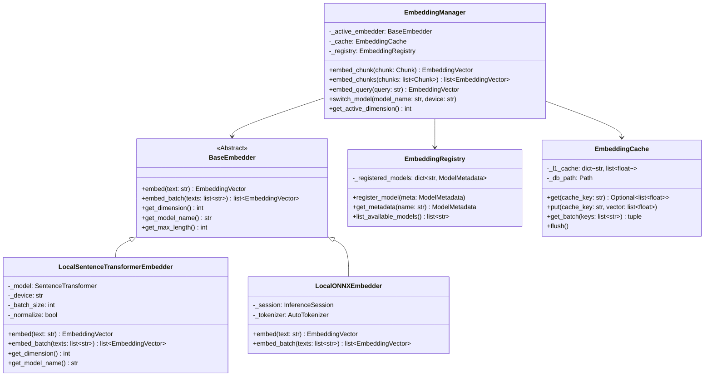

# Master Embedding Architecture Specification
## Sovereign On-Premise Agentic AI Workbench (SIH26117 / MRPL)
### Milestone 6: Offline Embedding Pipeline

---

## 1. Executive Summary & Air-Gapped Invariants

In an air-gapped refinery deployment (MRPL), the embedding pipeline must run **100% locally** without outbound requests to Hugging Face, OpenAI, or any cloud API. Furthermore, embedding generation for tens of thousands of document chunks is computationally expensive; therefore, the architecture mandates a **two-tier persistent embedding cache** (`L1 Memory` + `L2 Disk SQLite`) to ensure chunks are never re-embedded if their content hash (`sha256`) is unchanged.

### 1.1 Non-Negotiable Requirements
1. **Zero Cloud Connectivity:** All weights loaded from local directory paths (`models/embeddings/...`) using `local_files_only=True`.
2. **Configuration-Driven:** Model names, dimensions, batch sizes, and devices (`cpu`, `cuda`) are defined in `config/settings.yaml`—never hardcoded.
3. **Dynamic Model Switching:** Ability to switch between models (e.g. from `bge-small` to `e5-base` or `all-MiniLM`) at runtime with automatic collection namespacing in the Vector DB to prevent dimension collisions.
4. **Hardware Agnostic:** Supports pure CPU execution (with AVX2/AVX512 optimization), FP16 GPU inference (NVIDIA CUDA), and lightweight ONNX runtime execution for edge refinery PCs.

---

## 2. Supported Open-Weight Models Matrix

| Model Identifier | Parameter Count | Embedding Dim | Max Tokens | Local Directory | Primary Strengths |
|:---|:---|:---|:---|:---|:---|
| **`BAAI/bge-small-en-v1.5`** | 33.5M | **384** | 512 | `models/embeddings/bge-small-en-v1.5/` | Default; ultra-fast CPU inference; top MTEB retrieval performance. |
| **`BAAI/bge-base-en-v1.5`** | 109M | **768** | 512 | `models/embeddings/bge-base-en-v1.5/` | Deep semantic precision; excellent complex technical query understanding. |
| **`intfloat/e5-base-v2`** | 109M | **768** | 512 | `models/embeddings/e5-base-v2/` | Strong asymmetric query-to-passage search; prefix-aware (`passage:` / `query:`). |
| **`sentence-transformers/all-MiniLM-L6-v2`** | 22.7M | **384** | 256 | `models/embeddings/all-MiniLM-L6-v2/` | Lightweight fallback; minimal RAM footprint (<150MB); edge PC compatible. |

---

## 3. Class Architecture & Design



---

## 4. Component Deep Dive

### 4.1 Embedding Registry (`embedding_registry.py`)
Decouples model metadata from execution logic:
```python
class EmbeddingModelMetadata(BaseModel):
    model_name: str
    dimension: int
    max_length: int
    local_relative_path: str
    query_prefix: str = ""
    passage_prefix: str = ""
    normalize_embeddings: bool = True
```
A central registry maps configuration strings (e.g. `settings.embedding.name`) to model specs.

### 4.2 Local Model Loader (`model_loader.py`)
Enforces air-gapped loading rules:
```python
def load_local_model(local_path: Path, device: str = "cpu") -> SentenceTransformer:
    if not local_path.exists():
        raise FileNotFoundError(
            f"Air-gapped model directory '{local_path}' does not exist. "
            "Download weights and place in local directory prior to deployment."
        )
    # local_files_only=True prevents any external network request
    return SentenceTransformer(str(local_path), device=device, local_files_only=True)
```

### 4.3 Two-Tier Persistent Embedding Cache (`embedding_cache.py`)
To prevent re-calculating embeddings when files are re-scanned or re-parsed:
1. **L1 Memory Cache:** LRU dictionary of 20,000 vectors for low-latency retrieval queries.
2. **L2 SQLite Disk Cache:** Persistent disk database at `./vector_db/embedding_cache.sqlite`.
   - **Schema:**
     ```sql
     CREATE TABLE IF NOT EXISTS chunk_embeddings (
         cache_key TEXT PRIMARY KEY,   -- sha256(model_name + ":" + chunk_sha256)
         model_name TEXT NOT NULL,
         dimension INTEGER NOT NULL,
         vector_blob BLOB NOT NULL,     -- IEEE 754 float32 raw bytes (len = dim * 4)
         created_at TIMESTAMP DEFAULT CURRENT_TIMESTAMP
     );
     CREATE INDEX IF NOT EXISTS idx_model ON chunk_embeddings(model_name);
     ```
   - **Vector Serialization:** Stored as packed `float32` byte buffers (`struct.pack(f'{dim}f', *vector)`), providing zero serialization overhead and minimum disk usage (e.g. 384 dimensions = 1,536 bytes per chunk).

### 4.4 Embedding Manager (`embedding_manager.py`)
Coordinates batching, caching, and model switching:
```python
class EmbeddingManager:
    def embed_chunks(self, chunks: list[Chunk]) -> list[EmbeddingVector]:
        # 1. Compute cache keys for all chunks
        cache_keys = [
            hashlib.sha256(f"{self.model_name}:{c.metadata.sha256}".encode()).hexdigest()
            for c in chunks
        ]
        
        # 2. Check cache
        cached_vectors, missing_indices = self.cache.get_batch(cache_keys)
        
        # 3. If any uncached chunks exist, batch embed locally
        if missing_indices:
            missing_texts = [chunks[i].content for i in missing_indices]
            computed_vectors = self._embedder.embed_batch(missing_texts)
            
            # Store in cache
            for idx, vec in zip(missing_indices, computed_vectors):
                self.cache.put(cache_keys[idx], vec.vector)
                cached_vectors[idx] = vec
                
        return cached_vectors
```

---

## 5. Model Switching & Vector Store Isolation

When an administrator switches from `bge-small` (384d) to `bge-base` (768d), vectors cannot be inserted into the same collection without corrupting the distance metric.

**Collection Namespacing Pattern:**
The collection name in Vector DB is dynamically namespaced by model slug and dimension:
```text
collection_name = f"{settings.vector_db.collection_name}_{model_slug}_{dimension}d"
# Example: sovereign_kb_bge_small_384d
# Example: sovereign_kb_bge_base_768d
```
This guarantees:
- Zero dimension mismatch errors.
- Both models can coexist in the same local ChromaDB database.
- Seamless A/B testing and evaluation benchmarks.
