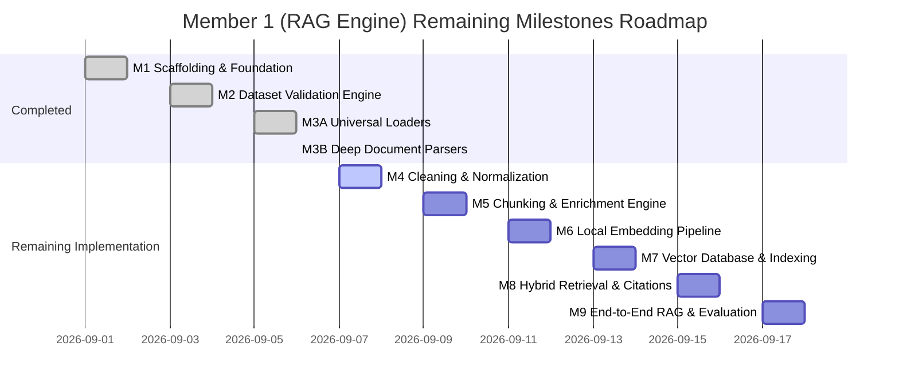

# Phased Implementation Plan & Execution Roadmap
## Sovereign On-Premise Agentic AI Workbench (SIH26117 / MRPL)
### Milestones 4 through 9 Implementation Blueprint

---

## 1. Roadmap Overview & Phasing

---

## 2. Detailed Milestone Breakdowns

### Milestone 4: Cleaning & Normalization Engine
- **Purpose:** Transform rich `ParsedDocument` instances into sanitized, noise-free text and table streams by stripping running headers/footers, normalizing unicode characters, expanding domain acronyms, and standardizing physical units.
- **Target Files:**
  - `rag_engine/interfaces/base_cleaner.py`
  - `rag_engine/preprocessing/text_sanitizer.py`
  - `rag_engine/preprocessing/unicode_normalizer.py`
  - `rag_engine/preprocessing/boilerplate_stripper.py`
  - `rag_engine/preprocessing/terminology_normalizer.py`
  - `rag_engine/preprocessing/table_normalizer.py`
  - `rag_engine/preprocessing/cleaner_factory.py`
  - `rag_engine/preprocessing/cleaning_engine.py`
  - `rag_engine/preprocessing/exceptions.py`
  - `rag_engine/preprocessing/__init__.py`
- **Dependencies:** `rag_engine/schemas/parsed_document.py` (M3B), `rag_engine/parsers/profiles/` (M3B).
- **Tests:** `tests/test_cleaning_engine.py` (Unicode NFKC, smart quotes, running headers/footers removal, unit standardization `barg` -> `bar`, `degC` -> `°C`).
- **Deliverables:** `CleaningEngine` delivering `CleanedParsedDocument` objects with lifecycle state `VALIDATED`.
- **Estimated Effort:** 1 Engineering Cycle.
- **Risks & Mitigations:**
  - *Risk:* Over-aggressive regexes stripping legitimate table headers or technical subheadings.
  - *Mitigation:* Strict boundary checks requiring recurring frequency across >3 pages before classifying a string as running header/footer.

---

### Milestone 5: Chunking & Metadata Enrichment Engine
- **Purpose:** Decompose cleaned parsed documents into contextual, semantically bounded `Chunk` objects carrying full provenance, equipment tags, safety standards, and exact source coordinates.
- **Target Files:**
  - `rag_engine/interfaces/base_chunker.py` (update contract to accept `ParsedDocument`)
  - `rag_engine/schemas/chunk.py` (implement full `ChunkMetadata` and `Chunk` specification from `CHUNK_SCHEMA.md`)
  - `rag_engine/chunking/token_counter.py`
  - `rag_engine/chunking/section_aware_chunker.py`
  - `rag_engine/chunking/table_aware_chunker.py`
  - `rag_engine/chunking/recursive_chunker.py`
  - `rag_engine/chunking/fixed_chunker.py`
  - `rag_engine/chunking/chunk_enricher.py`
  - `rag_engine/chunking/chunk_factory.py`
  - `rag_engine/chunking/chunking_engine.py`
  - `rag_engine/chunking/exceptions.py`
  - `rag_engine/chunking/__init__.py`
- **Dependencies:** `rag_engine/preprocessing/` (M4), `rag_engine/schemas/` (M1, M3B).
- **Tests:** `tests/test_chunking_engine.py`, `tests/test_chunk_enricher.py` (Token limits, sliding overlap, H1/H2 boundary preservation, table header replication across chunk splits, equipment tag inheritance).
- **Deliverables:** `ChunkingEngine` generating fully populated, deterministic `Chunk` objects ready for vectorization.
- **Estimated Effort:** 1.5 Engineering Cycles.
- **Risks & Mitigations:**
  - *Risk:* Large tables causing massive single chunks that overflow model context limits (512 tokens).
  - *Mitigation:* `TableAwareChunker` serializes tables in row batches (e.g. 10 rows per chunk), prepending the column header to each sub-chunk.

---

### Milestone 6: Offline Embedding Pipeline & Cache
- **Purpose:** Generate dense numerical vectors locally using open-weight models (`bge-small-en-v1.5`, `bge-base-en-v1.5`, `e5-base-v2`, `all-MiniLM-L6-v2`) backed by a persistent L1/L2 SQLite cache.
- **Target Files:**
  - `rag_engine/interfaces/base_embedder.py`
  - `rag_engine/schemas/embedding.py`
  - `rag_engine/embeddings/model_loader.py`
  - `rag_engine/embeddings/embedding_registry.py`
  - `rag_engine/embeddings/sentence_transformer_embedder.py`
  - `rag_engine/embeddings/onnx_embedder.py`
  - `rag_engine/embeddings/embedding_cache.py`
  - `rag_engine/embeddings/embedding_manager.py`
  - `rag_engine/embeddings/exceptions.py`
  - `rag_engine/embeddings/__init__.py`
- **Dependencies:** `rag_engine/chunking/` (M5), local model weights in `models/embeddings/`.
- **Tests:** `tests/test_embedding_pipeline.py`, `tests/test_model_switching.py` (Local weights loading, cache hit/miss latency, dimension validation, multi-worker batching, dynamic model switching).
- **Deliverables:** `EmbeddingManager` returning `list[EmbeddingVector]` with zero external network connectivity.
- **Estimated Effort:** 1.5 Engineering Cycles.
- **Risks & Mitigations:**
  - *Risk:* Missing CUDA or GPU memory limits on edge refinery laptops.
  - *Mitigation:* Automatic device fallback (`cuda` -> `cpu`) and inclusion of `ONNXEmbedder` optimized for multi-core CPU execution.

---

### Milestone 7: Vector Database & Indexing Backend
- **Purpose:** Implement persistent ChromaDB storage with HNSW indexing and metadata filtering, paired with an inverted BM25 keyword search index.
- **Target Files:**
  - `rag_engine/interfaces/base_vector_store.py`
  - `rag_engine/vector_store/chroma_store.py`
  - `rag_engine/vector_store/faiss_store.py`
  - `rag_engine/vector_store/bm25_index.py`
  - `rag_engine/vector_store/metadata_filter.py`
  - `rag_engine/vector_store/index_manager.py`
  - `rag_engine/vector_store/vector_store_factory.py`
  - `rag_engine/vector_store/exceptions.py`
  - `rag_engine/vector_store/__init__.py`
- **Dependencies:** `rag_engine/embeddings/` (M6), `rag_engine/chunking/` (M5).
- **Tests:** `tests/test_chroma_store.py`, `tests/test_bm25_index.py` (Insertion, persistence across restarts, metadata filtering on equipment/plant units, atomic deletion by document ID, vector count accuracy).
- **Deliverables:** Persistent, queryable vector and keyword indices in `./vector_db/`.
- **Estimated Effort:** 1 Engineering Cycle.
- **Risks & Mitigations:**
  - *Risk:* SQLite database locking under concurrent multi-process writes.
  - *Mitigation:* Enforce single-writer pattern using `filelock.FileLock` with configurable retry backoff.

---

### Milestone 8: Hybrid Retrieval, Cross-Encoder Reranking & Citations
- **Purpose:** Execute high-recall dense+sparse retrieval combined via Reciprocal Rank Fusion, apply high-precision cross-encoder reranking (`bge-reranker-base`), and generate verifiable citations.
- **Target Files:**
  - `rag_engine/interfaces/base_retriever.py`
  - `rag_engine/schemas/citation.py`
  - `rag_engine/schemas/retrieved_document.py`
  - `rag_engine/retrieval/query_preprocessor.py`
  - `rag_engine/retrieval/dense_retriever.py`
  - `rag_engine/retrieval/sparse_retriever.py`
  - `rag_engine/retrieval/reciprocal_rank_fusion.py`
  - `rag_engine/retrieval/hybrid_retriever.py`
  - `rag_engine/reranking/cross_encoder_reranker.py`
  - `rag_engine/reranking/null_reranker.py`
  - `rag_engine/citations/citation_builder.py`
  - `rag_engine/citations/context_formatter.py`
  - `rag_engine/citations/provenance_tracker.py`
  - `rag_engine/retrieval/__init__.py`
  - `rag_engine/reranking/__init__.py`
  - `rag_engine/citations/__init__.py`
- **Dependencies:** `rag_engine/vector_store/` (M7), `rag_engine/embeddings/` (M6), local reranker weights in `models/reranker/`.
- **Tests:** `tests/test_hybrid_retriever.py`, `tests/test_cross_encoder_reranker.py`, `tests/test_citation_builder.py` (Parallel search execution, RRF mathematical accuracy, top-K reranking score calibration, exact citation formatting).
- **Deliverables:** `HybridRetriever` returning `RetrievedDocument` with exact source page numbers and quotes.
- **Estimated Effort:** 1.5 Engineering Cycles.
- **Risks & Mitigations:**
  - *Risk:* Cross-encoder reranking introducing excessive latency (>300ms) on CPU.
  - *Mitigation:* Cap reranker candidate pool to top 15 chunks; provide `NullReranker` pass-through toggle in `settings.rag.rerank`.

---

### Milestone 9: End-to-End RAG Ingestion Orchestrator & Evaluation
- **Purpose:** Build master batch and incremental ingestion pipelines, construct end-to-end query orchestrator, and evaluate IR performance (Recall@K, MRR, NDCG) against golden refinery query benchmarks.
- **Target Files:**
  - `rag_engine/pipeline/ingestion_orchestrator.py`
  - `rag_engine/pipeline/incremental_updater.py`
  - `rag_engine/pipeline/query_pipeline.py`
  - `rag_engine/pipeline/pipeline_events.py`
  - `rag_engine/pipeline/pipeline_metrics.py`
  - `rag_engine/pipeline/exceptions.py`
  - `rag_engine/pipeline/__init__.py`
  - `rag_engine/evaluation/benchmark_dataset.py`
  - `rag_engine/evaluation/metrics.py`
  - `rag_engine/evaluation/benchmark_runner.py`
  - `rag_engine/evaluation/__init__.py`
- **Dependencies:** All previous milestones (M1 through M8).
- **Tests:** `tests/test_ingestion_orchestrator.py`, `tests/test_incremental_updater.py`, `tests/test_query_pipeline.py`, `tests/test_evaluation_metrics.py`.
- **Deliverables:** Complete CLI and Python API for batch ingestion and querying, with formal benchmark evaluation reports.
- **Estimated Effort:** 1.5 Engineering Cycles.
- **Risks & Mitigations:**
  - *Risk:* Batch processing all 29,600 files consuming excessive time on single thread.
  - *Mitigation:* Multiprocessing worker pool in `IngestionOrchestrator` with progress reporting and checkpointing.
