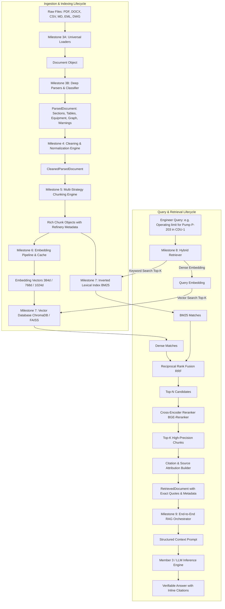
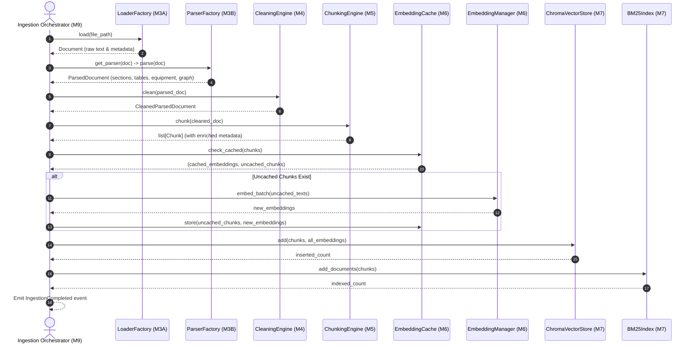
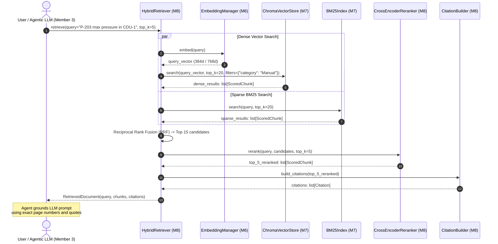

# Master RAG Architecture Blueprint
## Sovereign On-Premise Agentic AI Workbench (SIH26117 / MRPL)
### Member 1: Knowledge Base / RAG Engine

---

## 1. Executive Summary & Architectural Invariants

This document constitutes the final, authoritative architecture specification for the remaining milestones of **Member 1 (Knowledge Base & RAG Engine)** for the Smart India Hackathon 2026 project **Sovereign On-Premise Agentic AI Workbench** for **Mangalore Refinery and Petrochemicals Limited (MRPL)**.

Milestone 3A (Universal Document Loading Framework) and Milestone 3B (Deep Document Parsing Engine) are **complete and verified**. This blueprint governs everything downstream of parsing:
- **Milestone 4:** Cleaning & Normalization Engine
- **Milestone 5:** Chunking Engine
- **Milestone 6:** Embedding Pipeline
- **Milestone 7:** Vector Database Backend
- **Milestone 8:** Retrieval & Reranking Engine
- **Milestone 9:** Complete End-to-End RAG Pipeline & Evaluation

### 1.1 Non-Negotiable Architectural Invariants
1. **100% Offline & Air-Gapped:** Zero external API calls, zero web requests, zero telemetric phoning home. All model weights, configurations, vector stores, and caches must execute strictly from local on-premise hardware.
2. **Deterministic Provenance & Source Citations:** Every retrieved chunk must retain full lineage back to its source document: `document_id`, `source_path`, `page_number`, `section_title`, `equipment_entities`, `safety_standards`, `sha256`, and character offsets.
3. **Multi-Model & Multi-Backend Abstraction:** No hardcoded model weights, vector database backends, or chunking parameters. Everything is decoupled via Abstract Base Classes (ABCs), Factory patterns, and dynamic Registries.
4. **Resiliency & Incremental State Management:** Ingestion must be idempotent and hash-based (`sha256`). If a document has already been processed, it must not be re-parsed or re-embedded needlessly.
5. **Zero Modification of Completed Milestones:** Milestone 1, Milestone 2, Milestone 3A, and Milestone 3B remain completely untouched. Downstream modules interface cleanly with existing outputs (`Document` and `ParsedDocument`).

---

## 2. End-to-End Pipeline Architecture

The end-to-end system separates cleanly into two operational lifecycles:
1. **Offline Ingestion & Indexing Pipeline (Batch / Incremental):** Transforms raw refinery documents into indexed vector stores and lexical keyword indexes.
2. **Online Query & Retrieval Pipeline (Real-Time / Low-Latency):** Accepts user or agent queries, performs hybrid search, cross-encoder reranking, and constructs citation-grounded context blocks for downstream LLM generation.



---

## 3. Component Interaction & Module Boundaries

Each milestone occupies an isolated, single-responsibility module within the `rag_engine` package:

```text
rag_engine/
├── preprocessing/         # Milestone 4: Cleaning, sanitization, boilerplate removal
├── chunking/              # Milestone 5: Section-aware, recursive, table-aware chunkers
├── embeddings/            # Milestone 6: Model loader, registry, cache, batch embedder
├── vector_store/          # Milestone 7: ChromaDB, FAISS, BM25 indices, persistence
├── retrieval/             # Milestone 8: Hybrid retriever, RRF, filtering, citations
├── reranking/             # Milestone 8: Local Cross-Encoder model integration
├── pipeline/              # Milestone 9: Ingestion orchestrator, query pipeline
└── evaluation/            # Milestone 9: Benchmark metrics (Recall@K, MRR, NDCG)
```

### 3.1 Module Responsibilities & Contracts

| Module | Input Contract | Output Contract | Primary Responsibilities |
|:---|:---|:---|:---|
| **`preprocessing` (M4)** | `ParsedDocument` from Milestone 3B | `CleanedParsedDocument` | Unicode normalization, whitespace control, header/footer noise stripping, refinery acronym expansion, unit standardization. |
| **`chunking` (M5)** | `CleanedParsedDocument` | `list[Chunk]` | Hierarchical section-aware chunking, table row serialization, sentence-preserving recursive chunking, chunk metadata enrichment (equipment tags, safety notices). |
| **`embeddings` (M6)** | `list[Chunk]` or `list[str]` | `list[EmbeddingVector]` | Offline local model execution (`bge-small`, `bge-base`, `e5`, `minilm`), multi-worker batching, disk-backed embedding cache. |
| **`vector_store` (M7)** | `list[Chunk]` + `list[EmbeddingVector]` | `int` count / IDs | ChromaDB persistence, collection management, dimension enforcement, atomic updates, duplicate prevention via SHA-256. |
| **`retrieval` & `reranking` (M8)** | Query string `str` + filter dict | `RetrievedDocument` | Hybrid Dense+Sparse search, Reciprocal Rank Fusion, Cross-Encoder reranking, Citation coordinate formatting. |
| **`pipeline` & `evaluation` (M9)** | Filesystem paths / Query strings | `RAGResult` & Benchmark scores | Complete batch ingestion coordinator, real-time RAG context synthesizer, automated IR evaluation. |

---

## 4. Public Interfaces & Abstract Base Classes

All downstream modules inherit from strict Abstract Base Classes located in `rag_engine/interfaces/`:

### 4.1 Cleaner Interface (`BaseCleaner`)
```python
class BaseCleaner(ABC):
    @abstractmethod
    def clean(self, parsed_doc: ParsedDocument) -> CleanedParsedDocument:
        """Sanitize text streams, clean tables, and normalize terminology."""
        ...
```

### 4.2 Chunker Interface (`BaseChunker`)
```python
class BaseChunker(ABC):
    @abstractmethod
    def chunk(self, document: ParsedDocument) -> list[Chunk]:
        """Decompose a parsed document into contextual chunks."""
        ...
    @abstractmethod
    def get_strategy_name(self) -> str:
        """Return strategy identifier (e.g. 'section_aware', 'recursive', 'table_aware')."""
        ...
```

### 4.3 Embedder Interface (`BaseEmbedder`)
```python
class BaseEmbedder(ABC):
    @abstractmethod
    def embed(self, text: str) -> EmbeddingVector: ...
    @abstractmethod
    def embed_batch(self, texts: list[str]) -> list[EmbeddingVector]: ...
    @abstractmethod
    def get_dimension(self) -> int: ...
    @abstractmethod
    def get_model_name(self) -> str: ...
```

### 4.4 Vector Store Interface (`BaseVectorStore`)
```python
class BaseVectorStore(ABC):
    @abstractmethod
    def add(self, chunks: list[Chunk], embeddings: list[EmbeddingVector]) -> int: ...
    @abstractmethod
    def search(self, query_embedding: EmbeddingVector, top_k: int = 5, filters: Optional[dict] = None) -> list[ScoredChunk]: ...
    @abstractmethod
    def delete(self, chunk_ids: list[str]) -> int: ...
    @abstractmethod
    def count(self) -> int: ...
    @abstractmethod
    def clear(self) -> None: ...
```

### 4.5 Retriever Interface (`BaseRetriever`)
```python
class BaseRetriever(ABC):
    @abstractmethod
    def retrieve(self, query: str, top_k: int = 5, filters: Optional[dict] = None) -> RetrievedDocument: ...
    @abstractmethod
    def get_strategy_name(self) -> str: ...
```

---

## 5. Architectural Sequence Diagrams

### 5.1 End-to-End Document Ingestion Sequence



### 5.2 Real-Time Query & Retrieval Sequence



---

## 6. Future Integration Points

1. **Member 2 (Multimodal OCR & Vision):**
   - For engineering drawings (`.dwg`, `.png`) or scanned documents, Member 2 will populate `Chunk.content` with OCR transcripts and bounding boxes.
   - The `ChunkMetadata.image_reference` field directly maps visual bounding boxes back to the original raster file.
2. **Member 3 (Agentic LLM Subsystem):**
   - Receives `RetrievedDocument` containing clean, deduplicated chunks with confidence scores and `EntityGraph` adjacency edges.
   - The agent can navigate connected equipment (e.g. `P-203` -> `connected_to` -> `V-12`) using pre-built graph nodes without running LLM extraction at query time.
3. **Incremental Ingestion & File Watcher:**
   - Manifest-level checksum comparison ensures that dropping a new manual into `datasets/manuals/` only processes the new file, skipping the other 29,000 unmodified files.
