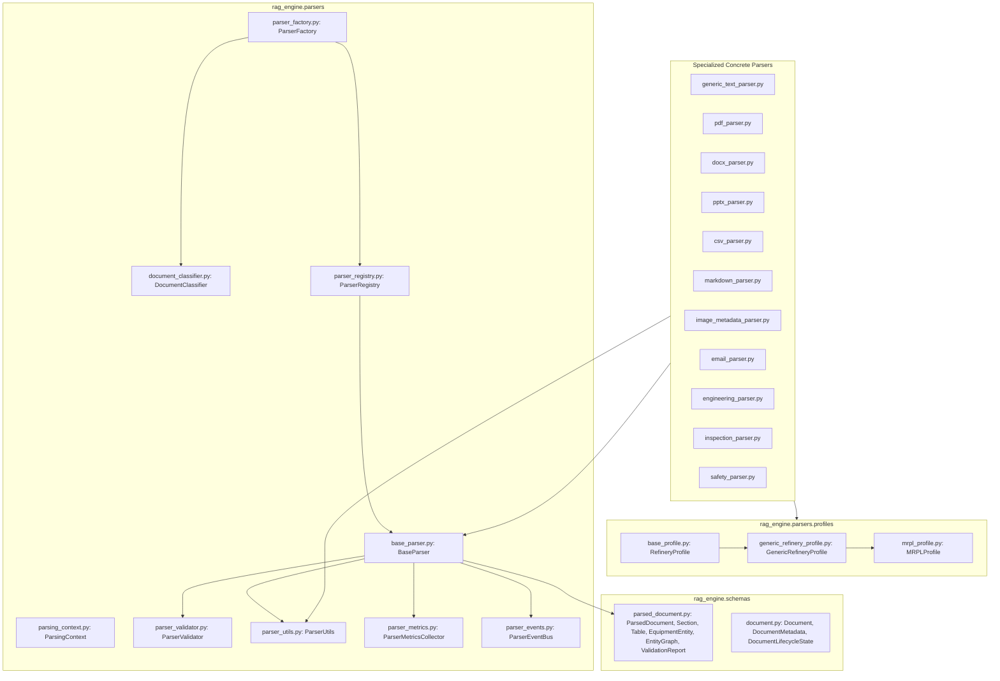
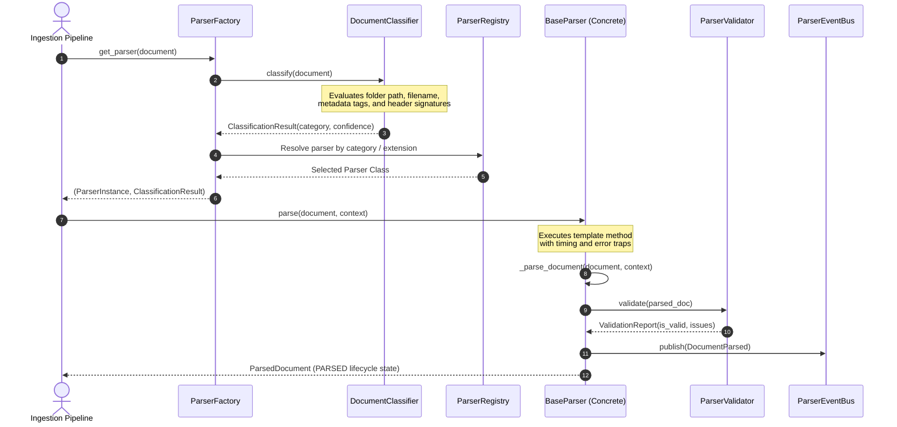

# MILESTONE 3B COMPLETION REPORT
## Deep Document Parsing Engine

**Project:** Sovereign On-Premise Agentic AI Workbench  
**Problem Statement:** SIH26117  
**Organization:** Mangalore Refinery and Petrochemicals Limited (MRPL)  
**Lead Role:** Member 1 — Knowledge Base (RAG) & Data Engineering  
**Completion Date:** 2026-09-06  
**Quality Status:** Production-Grade / 100% Deterministic & Air-Gapped / 58 of 58 Tests Passing  

---

## 1. Executive Summary

Milestone 3B builds the deep document parsing engine that transforms raw loaded `Document` objects into rich, semantically structured `ParsedDocument` entities containing refinery operational intelligence.

Strict architectural boundaries were maintained:
- **No OCR / Computer Vision:** Only extracted image dimensions, DPI, file sizes, and title block metadata.
- **No Chunking / Embeddings / Vector Stores:** Deferred to Milestones 5, 6, and 7.
- **No LLM / Inference:** Zero nondeterministic AI calls. 100% deterministic rule-based grammar and layout parsing.
- **Air-Gapped & Offline:** Operates without internet connectivity or external APIs.

---

## 2. Architecture & Pipeline Diagrams

### 2.1 Complete Ingestion to Parsing Pipeline


### 2.2 Dependency Graph



### 2.3 Sequence Diagram: Classifier-Driven Resolution & Parsing



---

## 3. Key Accomplishments

### 3.1 DocumentClassifier (`document_classifier.py`)
- **No AI / No Embeddings:** Rule-based multi-tier classifier analyzing folder location, file naming conventions, metadata tags, and content signatures in the header.
- **8 Categories:** `Manual`, `Inspection Report`, `Safety Document`, `Maintenance Record`, `Email`, `Engineering Drawing`, `Template`, `Unknown`.

### 3.2 Refinery Profile Architecture (`profiles/`)
- **Zero Hardcoding:** Generic rules and MRPL-specific nomenclature are decoupled into profile classes.
- **Multi-Refinery Ready:** Future refineries (HPCL, IOCL, ONGC, BPCL, Reliance) can be onboarded simply by registering a new `RefineryProfile` subclass without altering parser logic.

### 3.3 Structured Refinery Knowledge & EntityGraph
- **Equipment Extraction:** Isolates equipment tags (`P-203`, `MOV-101`, `HX-01`, `C-301`), equipment type (`PUMP`, `VALVE`, `COMPRESSOR`, `HEAT_EXCHANGER`), operating pressures, operating temperatures, physical units (`bar`, `psi`, `°C`), loop numbers (`LIC-101`), and pipe lines (`LINE-101-CS`).
- **EntityGraph:** Discovers relationships within text contexts and builds directed graph edges (`connected_to`, `feeds`, `regulates`, `monitors`, `powers`, `bypasses`, `isolates`).
- **Safety Warnings:** Identifies `DANGER`, `WARNING`, `CAUTION`, `NOTICE` statements and maps cited standards (`OISD-105`, `PNGRB`, `API 610`, `ASME B31.3`).
- **Citation Auditability:** Every entity, section, table, and warning carries a `confidence: float` score and precise `CitationCoordinates` (page number, section title, character offsets).

### 3.4 Validation Layer (`parser_validator.py`)
- Detects broken heading hierarchies (e.g. H1 directly to H3).
- Identifies duplicate headings at the same level.
- Validates table cell-to-column parity and empty tables.
- Flags conflicting equipment tag types (e.g. tag declared as both Pump and Valve).
- Emits a comprehensive `ValidationReport`.

### 3.5 Streaming Support
- Implements `BaseParser.parse_stream(doc, context) -> Iterator[Section]` yielding sections sequentially, enabling lazy, memory-bounded parsing of manuals exceeding 1,000 pages.

---

## 4. Test Suite & Coverage

Exhaustive pytest execution across 58 test cases:
```powershell
& "d:\SovereignAI\myenv\Scripts\python.exe" -m pytest tests/ -v
```

```text
============================= test session starts =============================
platform win32 -- Python 3.11.9, pytest-9.1.1, pluggy-1.6.0
collected 58 items

tests/test_concrete_loaders.py (10 tests) .............................. PASSED
tests/test_concrete_parsers.py (11 tests) .............................. PASSED
tests/test_duplicate_detector.py (1 test) .............................. PASSED
tests/test_hash_generator.py (3 tests) ................................. PASSED
tests/test_loader_framework.py (7 tests) ............................... PASSED
tests/test_loader_thread_safety.py (1 test) ............................ PASSED
tests/test_manifest_generator.py (1 test) .............................. PASSED
tests/test_orchestrator.py (1 test) .................................... PASSED
tests/test_parser_framework.py (5 tests) ............................... PASSED
tests/test_parser_thread_safety.py (1 test, 20 threads) ................ PASSED
tests/test_parser_validator.py (5 tests) ............................... PASSED
tests/test_scanner.py (2 tests) ........................................ PASSED
tests/test_statistics.py (1 test) ...................................... PASSED
tests/test_utils.py (3 tests) .......................................... PASSED
tests/test_validator.py (6 tests) ...................................... PASSED

============================= 58 passed in 1.50s ==============================
```

---

## 5. Artifacts and Deliverables

| File Path | Description |
|:---|:---|
| `rag_engine/schemas/parsed_document.py` | Complete Pydantic v2 schemas for ParsedDocument, Section, Table, EquipmentEntity, EntityGraph, ValidationReport. |
| `rag_engine/parsers/profiles/base_profile.py` | Abstract refinery configuration profile. |
| `rag_engine/parsers/profiles/generic_refinery_profile.py` | Standard hydrocarbon refinery profile. |
| `rag_engine/parsers/profiles/mrpl_profile.py` | MRPL Mangalore Refinery complex profile. |
| `rag_engine/parsers/profiles/__init__.py` | Profile factory and registry. |
| `rag_engine/parsers/document_classifier.py` | Deterministic multi-tier document classifier. |
| `rag_engine/parsers/parsing_context.py` | Parser configuration and execution context. |
| `rag_engine/parsers/parser_validator.py` | Structural hierarchy and consistency validator. |
| `rag_engine/parsers/parser_utils.py` | Regex tokenizer, table converter, and graph builder. |
| `rag_engine/parsers/base_parser.py` | Abstract Base Class with template method and `parse_stream`. |
| `rag_engine/parsers/parser_registry.py` | Thread-safe registry mapping extensions & categories. |
| `rag_engine/parsers/parser_factory.py` | Factory resolving parser after classifier invocation. |
| `rag_engine/parsers/plugin_parser.py` | Dynamic runtime plugin loader. |
| `rag_engine/parsers/parser_metrics.py` | Thread-safe operational telemetry aggregator. |
| `rag_engine/parsers/parser_events.py` | Structured audit event bus with pub/sub. |
| `rag_engine/parsers/parser_health.py` | Health diagnostics report. |
| `rag_engine/parsers/exceptions.py` | Custom parser exception hierarchy. |
| `rag_engine/parsers/generic_text_parser.py` | Universal plain text parser. |
| `rag_engine/parsers/pdf_parser.py` | Page-aware PDF parser with page coordinate mapping. |
| `rag_engine/parsers/docx_parser.py` | Word document parser with native XML table extraction. |
| `rag_engine/parsers/pptx_parser.py` | Slide presentation parser. |
| `rag_engine/parsers/csv_parser.py` | Spreadsheet data parser with cell coordinates. |
| `rag_engine/parsers/markdown_parser.py` | Markdown parser with YAML frontmatter. |
| `rag_engine/parsers/image_metadata_parser.py` | Engineering drawing parser without OCR/CV. |
| `rag_engine/parsers/email_parser.py` | Email parser extracting action items and headers. |
| `rag_engine/parsers/engineering_parser.py` | Refinery manual and specification parser. |
| `rag_engine/parsers/inspection_parser.py` | Inspection and NDT report parser. |
| `rag_engine/parsers/safety_parser.py` | Safety manual and regulatory clause parser. |
| `tests/test_parser_framework.py` | Framework unit tests. |
| `tests/test_concrete_parsers.py` | Parser unit and feature tests. |
| `tests/test_parser_validator.py` | Validator integrity tests. |
| `tests/test_parser_thread_safety.py` | 20-thread stress and concurrency test. |
| `project_management/milestone_reports/milestone_03B.md` | Formal milestone completion report. |
| `MILESTONE_03B_COMPLETION_REPORT.md` | Root-level executive milestone completion report. |

---

## 6. Next Milestone Recommendation

**Milestone 4: Cleaning & Normalization Engine**
- Build text sanitization, unicode normalization, and whitespace cleanup.
- Remove visual headers, footers, page numbering artifacts, and repeated boilerplate.
- Normalize refinery acronyms (`CDU`, `VDU`, `LOTO`, `PTW`, `MOV`) and units (`kg/cm²`, `barg`, `°C`).
- Feed clean, normalized streams directly into **Milestone 5: Chunking Engine**.
