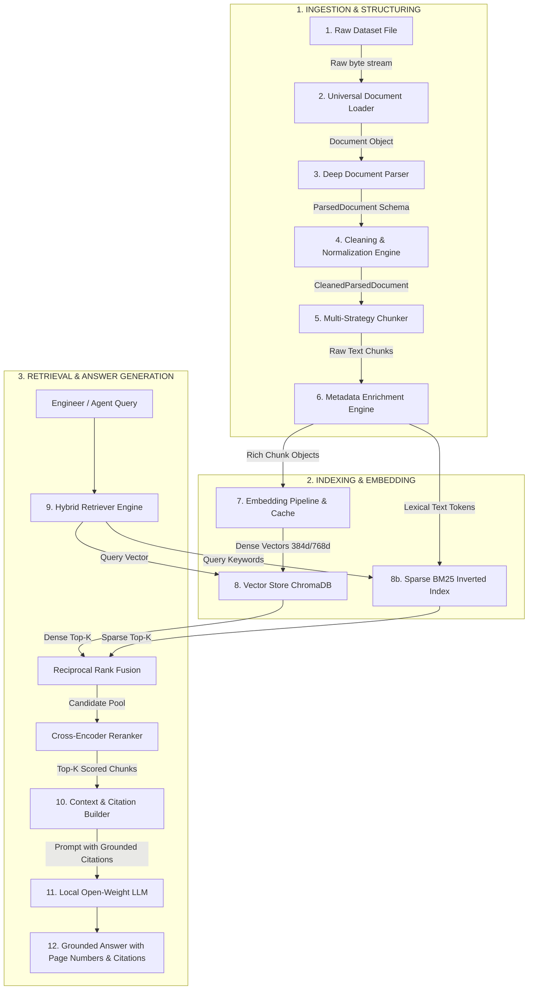

# RAG End-to-End Data Flow Specification
## Sovereign On-Premise Agentic AI Workbench (SIH26117 / MRPL)

---

## 1. Executive Summary & Flow Visualization

This document traces the complete lifecycle of data through the Sovereign AI Knowledge Base: from raw, unstructured refinery documents on disk to grounded, verifiable answers generated by local open-weight LLMs.

---

## 2. Stage-by-Stage Data Transformation

### Stage 1: Raw Dataset (`datasets/`)
- **Input:** Heterogeneous on-premise refinery files across 12 directories (manuals, safety docs, P&IDs, inspection reports, maintenance logs, emails, drawings).
- **Properties:** Formats include PDF, DOCX, PPTX, XLSX, CSV, TXT, Markdown, PNG, JPEG, DWG. Total count: ~29,600 files.
- **Transformation:** Read-only access by the ingestion crawler.

### Stage 2: Universal Document Loader (Milestone 3A)
- **Engine:** `LoaderFactory` -> Specialized Loader (`PDFLoader`, `DOCXLoader`, etc.) with dual-driver fallback.
- **Transformation:** Reads physical bytes, validates magic bytes, extracts raw text strings, and captures filesystem metadata.
- **Output Schema:** `Document`
  - `doc_id: str` (Deterministic UUIDv5)
  - `content: str` (Raw text with page/slide breaks)
  - `metadata.lifecycle_state: DocumentLifecycleState.LOADED`
  - `metadata.checksum_sha256: str`
  - `metadata.file_format: str`

### Stage 3: Deep Document Parser (Milestone 3B)
- **Engine:** `DocumentClassifier` -> `ParserFactory` -> Specialized Parser (`EngineeringParser`, `SafetyParser`, etc.) + `RefineryProfile` (`MRPLProfile`).
- **Transformation:** Deterministically parses document layout, heading depth (H1–H6), tabular structures, equipment tags (`P-203`, `MOV-101`), operating limits (pressures, temperatures), directed `EntityGraph` relationships (`connected_to`, `feeds`), and safety notices (`DANGER`, `WARNING`).
- **Output Schema:** `ParsedDocument`
  - `sections: list[Section]` (H1-H6, body, paragraphs, bullet points, citation coordinates)
  - `tables: list[Table]` (headers, rows, cells, DataFrame dictionary)
  - `equipment: list[EquipmentEntity]` (tags, limits, loops, pipes)
  - `entity_graph: EntityGraph` (nodes, directed edges)
  - `warnings: list[SafetyWarning]` (severity, standards)
  - `validation_report: ValidationReport`
  - `lifecycle_state: DocumentLifecycleState.PARSED`

### Stage 4: Cleaning & Normalization Engine (Milestone 4)
- **Engine:** `CleaningEngine` (`UnicodeNormalizer`, `BoilerplateStripper`, `TerminologyNormalizer`).
- **Transformation:**
  1. **Unicode Sanitization:** Replaces smart quotes, non-breaking spaces, em-dashes, and null bytes with standardized ASCII/UTF-8.
  2. **Noise & Boilerplate Removal:** Detects running headers, footers, repetitive confidentiality notices, and pagination strings (e.g. `Page 14 of 120`).
  3. **Refinery Terminology Normalization:** Standardizes plant acronyms (`CDU`, `VDU`, `LOTO`, `PTW`) and physical units (`barg`, `bar(g)` -> `bar`; `deg C`, `degC` -> `°C`).
  4. **Table Cleansing:** Strips markdown alignment artifacts and empty rows.
- **Output Schema:** `CleanedParsedDocument`
  - Cleaned text streams per section.
  - Sanitized table cells and captions.
  - `lifecycle_state: DocumentLifecycleState.VALIDATED`

### Stage 5: Multi-Strategy Chunker (Milestone 5)
- **Engine:** `ChunkingEngine` (`SectionAwareChunker`, `TableAwareChunker`, `RecursiveTokenChunker`).
- **Transformation:**
  - Decomposes sections and tables into semantically coherent text segments adhering to token budget constraints (e.g., 512 tokens with 50-token sliding overlap).
  - **Section-Aware Boundary:** Never splits across H1 or H2 headings unless section length exceeds maximum token capacity.
  - **Table-Aware Serialization:** Preserves complete table headers with each chunked row group, preventing detached table cells.
- **Output:** Raw chunk segments with start/end character offsets.

### Stage 6: Metadata Enrichment Engine (Milestone 5)
- **Engine:** `ChunkMetadataEnricher`.
- **Transformation:** Injects parent document lineage and refinery intelligence into every individual chunk:
  - Equipment tags appearing in or associated with the chunk's parent section.
  - Safety warnings and regulatory standards (`OISD-105`, `API 610`) governing that section.
  - Page number, section title, parent document SHA-256, category, and subcategory.
- **Output Schema:** `Chunk` (Full schema specified in `CHUNK_SCHEMA.md`).
  - `chunk_id: str`
  - `content: str`
  - `metadata: ChunkMetadata`

### Stage 7: Embedding Pipeline & Cache (Milestone 6)
- **Engine:** `EmbeddingManager` + `EmbeddingCache` (Local sentence-transformers running offline).
- **Transformation:**
  1. Checks `EmbeddingCache` using chunk `sha256` content hash.
  2. For cache misses, generates dense numerical vector representations (e.g., 384 dimensions for `bge-small-en-v1.5` or 768 dimensions for `bge-base-en-v1.5`).
  3. Caches vectors to disk SQLite / LMDB cache to ensure zero redundant computation.
- **Output Schema:** `EmbeddingVector`
  - `vector: list[float]`
  - `dimension: int`
  - `model_name: str`

### Stage 8: Vector Store & Lexical Indexing (Milestone 7)
- **Engine:** `ChromaVectorStore` (Persistent embedded ChromaDB) + `BM25Index` (Inverted word index).
- **Transformation:**
  - Dense vectors and chunk metadata are written to persistent HNSW SQLite/Parquet files in `./vector_db/chroma/`.
  - Tokenized chunk text is indexed into a local BM25 inverted index for exact keyword matching (equipment tags, loop numbers, valve IDs).
- **Output:** Fully indexed, persistent on-premise knowledge repository.

### Stage 9: Hybrid Retrieval Engine (Milestone 8)
- **Engine:** `HybridRetriever` (`DenseRetriever` + `SparseBM25Retriever` + `RRF_Fuser` + `CrossEncoderReranker`).
- **Transformation:**
  1. Accepts user/agent query: e.g., *"What is the operating pressure limit of Pump P-203 in CDU-1?"*
  2. Generates dense query embedding via `EmbeddingManager`.
  3. Executes parallel searches:
     - Vector store returns top-20 nearest neighbors by cosine distance.
     - BM25 returns top-20 exact keyword matches for `P-203` and `CDU-1`.
  4. Combines results using Reciprocal Rank Fusion (RRF):
     $$RRF\_Score(d) = \sum_{m \in \{dense, sparse\}} \frac{1}{k + rank_m(d)} \quad (k=60)$$
  5. Passes fused top-15 candidates to a local cross-encoder model (`BAAI/bge-reranker-base`) for full attention re-scoring.
  6. Selects top-5 highest-scoring chunks.
- **Output Schema:** `list[ScoredChunk]`

### Stage 10: Context & Citation Builder (Milestone 8)
- **Engine:** `CitationBuilder`.
- **Transformation:**
  - Synthesizes retrieved chunks into an auditable prompt context block.
  - Generates deterministic inline citation references:
    `[Source 1: Emerson_Control_Valve_Handbook.pdf | Page 42 | Section 2.1 | Tag: P-203]`
  - Formats source excerpts with exact character start/end coordinates.
- **Output Schema:** `RetrievedDocument` containing `list[ScoredChunk]` and `list[Citation]`.

### Stage 11: Local Open-Weight LLM Generation (Downstream Member 3)
- **Engine:** Local LLM runtime (Ollama / vLLM / llama.cpp executing Mistral-7B, Llama-3-8B, or Qwen-2.5-7B offline).
- **Transformation:** Generates factual response strictly constrained to the provided context block, with zero hallucination.

### Stage 12: Verified Output Answer
- **Output:** High-precision, auditable answer presented to the refinery engineer or autonomous agent, with clickable citation references linking directly to source documents and page numbers.
