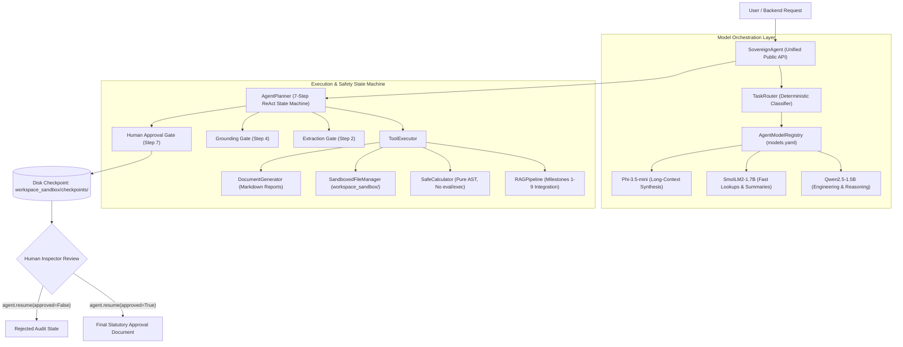

# Sovereign AI Workbench — Agent Orchestration Module (Member 2)

**Problem Statement ID:** SIH26117  
**Organization:** Mangalore Refinery and Petrochemicals Limited (MRPL)  
**Lead:** Member 2 — Agentic AI & LLM Orchestration Lead  
**Operating Environment:** 100% Offline | Air-Gapped | Local In-Process Inference  

---

## 1. Overview & Architecture

The `agent/` package delivers the intelligence and orchestration layer for the Sovereign On-Premise Agentic AI Workbench. It coordinates local open-weight language models, deterministic capability routing, safe tool execution (AST calculator, sandboxed file operations, document generation, RAG retrieval), and a multi-step ReAct planning engine with human-in-the-loop engineering approval gates.

### System Architecture Flow



### Component Summary
- **`agent.py` (`SovereignAgent`)**: Single stable entrypoint for the Backend API, providing `handle()`, `resume()`, and `warmup()`.
- **`router.py` (`TaskRouter`)**: Rule-based heuristic router directing queries to the optimal local model based on context length, role, and complexity.
- **`model_registry.py` (`AgentModelRegistry`)**: Catalog and health tracker managing active local weights configured via `models.yaml`.
- **`tool_executor.py` (`ToolExecutor`)**: Sandboxed tool runtime encapsulating the AST calculator, sandboxed I/O, report generation, and real in-process `RAGPipeline`.
- **`planner.py` (`AgentPlanner`)**: 7-step engineering compliance state machine enforcing strict halts upon unverified data or missing parameters.
- **`offline_proof.py` (`OfflineGuard`)**: Runtime air-gap compliance verifier intercepting and blocking socket/network calls.
- **`prompts/`**: Structured prompt templates for domain tasks, reasoning, and document drafting.

---

## 2. Safety Guarantees (Judge Focus)

Industrial refinery operations require zero tolerance for ungrounded AI hallucination. The Sovereign Agent implements defense-in-depth safety guarantees at every execution layer:

### 1. Extraction Gate (Step 2)
- When reading raw inspection records, the agent extracts required physical parameters (`equipment_id`, `design_pressure`, `shell_min_thickness`).
- If any critical parameter is missing or corrupted in the source document, the planner **immediately halts** with `is_verified=False` and `status="requires_verification"`.
- **The system never fabricates default or placeholder values.**

### 2. Grounding Gate (Step 4)
- Engineering calculations (corrosion rate, remaining life, MAWP under API 510) require grounded baseline readings.
- If a calculation relies on ungrounded or synthetic parameters without document lineage, the calculator sets `status="requires_verification"` and `is_verified=False`.
- The planner halts rather than silently marking calculations as successful.

### 3. Multi-Layer RAG Hallucination Defense
During evaluation, small open-weight LLMs were found capable of fabricating inline citation lists, inventing filenames (e.g. `api_510.pdf`, `oisd_130.pdf`), and generating ungrounded generic parameters (e.g. *"every five years"* or *"20%"*). This was addressed across three interlocking layers:
- **Layer 1 (Prompt Level):** The system prompt and generation instructions explicitly forbid the model from self-generating a References/Bibliography/Sources section (provenance is appended automatically by `ResponseFormatter`). If a specific parameter or interval requested by the user is not found in the context, the model is strictly mandated to state that it is *"not specified in the available documentation"*. Prompts are wrapped using native ChatML special tokens (`<|im_start|>system...`).
- **Layer 2 (Guardrail Level):** `HallucinationGuard` was extended to track units (`years`, `months`, `days`, `mm`, `cm`, `%`, `percent`) and numeral words (`one` through `ten`). It detects and strips any self-generated bibliography blocks prior to scoring, logs a prompt-compliance violation, and provides defense-in-depth sanitization of unverified assertions.
- **Layer 3 (Validator Level):** `CitationValidator` inspects generated text and cross-references any candidate source titles against authentic retrieved provenance document IDs. If fabricated document names are detected, it fails validation (`is_valid=False`, `citation_precision=0.0`).

### 4. Mandatory Human Approval Gate (Step 7)
- Before any statutory document is finalized, Step 7 of the planner **always pauses execution**.
- Full execution state, extracted parameters, calculated metrics, and draft text are serialized to disk in `workspace_sandbox/checkpoints/chk_<id>.json`.
- The document is never released until an authorized refinery engineer provides sign-off via `agent.resume(checkpoint_id=..., approved=True, engineer_name=...)`.

---

## 3. Before Running a Live Demo (CRITICAL)

> [!WARNING]
> **DO NOT RUN A LIVE DEMO COLD!**  
> On a fresh process startup, PyTorch must load `Qwen2.5-1.5B-Instruct` model weights and `BAAI/bge-small-en-v1.5` embeddings into CPU memory, as well as initialize the local Qdrant vector database.  
> **Cold-start latency is approximately 28–30 seconds.**  
> If you trigger your first demonstration query cold in front of judges, the UI/terminal will hang for ~30 seconds while weights are loaded.

### Warmup Pattern
Always call `agent.warmup()` during server startup or immediately after constructing `SovereignAgent()`, before allowing user interactions or presenting to evaluators:

```python
from agent.agent import SovereignAgent

# 1. Instantiate agent
agent = SovereignAgent()

# 2. Warm up immediately at application startup (absorbs the ~30s cold start)
print("Warming up agent models and vector database...")
warmup_ms = agent.warmup()
print(f"Agent is warm ({warmup_ms:.1f} ms). Ready for live demo!")

# 3. Subsequent user queries will now execute at production speed:
#    - ~150 ms on SQLite generation cache hit
#    - 3-5 seconds when generating fresh tokens with warm models
response = agent.handle("Process inspection report for V-2201 knockout drum...")
```

### Measured Latency Benchmarks
- **Cold Start (Unwarmed initial run):** ~29,830 ms (~30 seconds)
- **Warm Model (Fresh query, cache miss):** ~3,500 – 5,500 ms
- **Warm Model (Exact query, cache hit):** ~150 ms (via SQLite `generation_cache.db`)

---

## 4. Known Limitations

In the interest of full transparency and engineering integrity:

1. **Active Local Models:** Three models are active and verified: `Qwen2.5-1.5B` (General/Reasoning), `SmolLM2-1.7B` (Fast Lookups), and `Phi-3.5-mini` (Long Context). The coding specialist (`Qwen2.5-Coder-1.5B`) and vision specialist (`Phi-3.5-vision-instruct`) are registered in `models.yaml` for architecture completeness but are not pre-downloaded to conserve disk and RAM in the offline evaluation bundle.
2. **Deterministic Extraction Scope:** Data extraction from inspection reports currently utilizes pattern matching and regex heuristics. When encountering completely novel or non-standard document layouts, the agent safely halts (`is_verified=False`) rather than attempting ungrounded probabilistic extraction.
3. **Knowledge Base Breadth:** The vector store contains refinery inspection reports, SOPs, and safety guidelines. Questions outside the indexed document corpus will correctly report that information is *"not specified in the available documentation"* rather than hallucinate, but answer breadth is bounded by the indexed document set.
4. **CPU Inference Latency:** Running local LLMs on CPU without dedicated GPU acceleration exhibits token generation speeds of 15–25 tokens/sec. The warmup pattern documented above is essential to eliminate cold-start delays.

---

## 5. Quick Start: Component Demonstrations

Each component in the `agent/` module can be executed directly as a standalone demonstration:

```powershell
# 1. Model Registry Discovery & Readiness Check
# Validates models.yaml configuration, weight file integrity, and memory footprint.
python agent/model_registry.py

# 2. Heuristic Task Router
# Demonstrates classification and routing across Qwen2.5, SmolLM2, and Phi-3.5.
python agent/router.py

# 3. Sandboxed Tool Executor
# Demonstrates AST calculator security (blocks __import__, eval), sandbox path jailbreak defense, and RAG search.
python agent/tool_executor.py

# 4. 7-Step Engineering Planner
# Executes the ReAct state machine: reads V-2201 report, verifies thickness, computes remaining life, and pauses at Step 7.
python agent/planner.py

# 5. Full End-to-End Orchestration & Resume Sign-Off
# Demonstrates agent warmup, multi-step workflow handling, checkpoint creation, and resume approval.
python agent/agent.py

# 6. Air-Gap Socket Interception Proof
# Enforces strict offline compliance by attempting socket creation and proving all outbound connections are blocked.
python agent/offline_proof.py
```

---

## 6. Backend Integration Guide

The `SovereignAgent` class exposes a clean, stable contract designed for seamless FastAPI / Flask backend integration.

### Contract Overview

#### `agent.handle(user_request: str, **kwargs) -> AgentResponse`
Initiates a workflow. It never throws unhandled exceptions; errors and pause states are surfaced through the `AgentResponse` structure.

#### `agent.resume(checkpoint_id: str, approved: bool, engineer_name: str, comments: str = "") -> AgentResponse`
Resumes a workflow paused at Step 7 awaiting engineer sign-off.

### `AgentResponse` Schema

| Field | Type | Description |
| :--- | :--- | :--- |
| `status` | `str` | `"awaiting_approval"`, `"completed"`, `"requires_verification"`, or `"failed"` |
| `requires_approval` | `bool` | `True` when paused at Step 7 awaiting human sign-off |
| `is_verified` | `bool` | `False` if any safety gate or extraction check failed |
| `output` | `Any` | Dict containing step trace, generated report paths, and calculated values |
| `execution_trace` | `str` | Visual trace string: `"Step 1 -> Step 2 -> ... -> PAUSED: Step 7"` |
| `reasoning_steps` | `List[Dict]` | Structured list of each step's thought, action, and observation |
| `checkpoint_id` | `Optional[str]` | Checkpoint ID (e.g. `"chk_V-2201_1710284729"`) to pass to `resume()` |
| `checkpoint_path` | `Optional[str]` | Filesystem path to the persisted checkpoint JSON |
| `total_time_ms` | `float` | Total execution latency in milliseconds |
| `model_registry_status` | `Dict` | Health snapshot of all registered local models |

### Integration Example

```python
from agent.agent import SovereignAgent, AgentResponse

# Initialize singleton at backend startup
agent = SovereignAgent()
agent.warmup()

# --- Endpoint 1: POST /api/v1/agent/run ---
def run_workflow(prompt: str) -> dict:
    response: AgentResponse = agent.handle(prompt)
    
    if response.requires_approval:
        return {
            "status": "awaiting_approval",
            "checkpoint_id": response.checkpoint_id,
            "trace": response.execution_trace,
            "draft_report": response.output.get("draft_report"),
            "extracted_data": response.output.get("extracted_data"),
        }
    elif response.status == "completed":
        return {
            "status": "completed",
            "trace": response.execution_trace,
            "result": response.output,
        }
    else:
        return {
            "status": response.status,
            "halt_reason": response.halt_reason,
            "error": response.error,
        }

# --- Endpoint 2: POST /api/v1/agent/approve ---
def approve_checkpoint(checkpoint_id: str, approved: bool, engineer: str, notes: str) -> dict:
    resumed: AgentResponse = agent.resume(
        checkpoint_id=checkpoint_id,
        approved=approved,
        engineer_name=engineer,
        comments=notes,
    )
    return {
        "status": resumed.status,
        "trace": resumed.execution_trace,
        "final_document": resumed.output.get("final_document_path"),
    }
```
