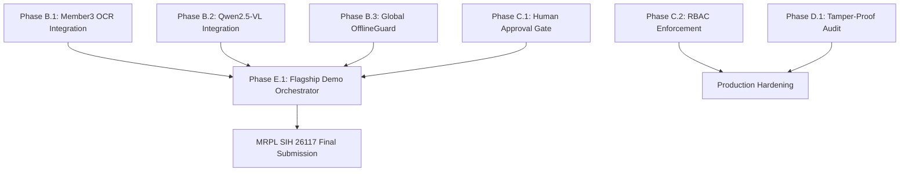

# SOVEREIGNAI — MRPL SIH 26117 IMPLEMENTATION ROADMAP

**Project:** SovereignAI  
**Location:** `E:\SovereignAI`  
**Problem Statement:** SIH26117 — Sovereign On-Premise Agentic AI Workbench using Open-Weight Multimodal LLMs for Confidential Industrial Work  
**Target Organization:** Mangalore Refinery and Petrochemicals Limited (MRPL)  
**Document:** `development_logs/MRPL_IMPLEMENTATION_ROADMAP.md`  

---

## 1. STRATEGIC IMPLEMENTATION OVERVIEW

This engineering roadmap provides a direct, phased execution plan to elevate SovereignAI from its current **80.5/100 readiness** to a **100/100 live demonstration grade** for the MRPL SIH 26117 evaluation.

The system's core foundations—air-gapped local RAG, multi-model routing, deterministic calculation tools, and deliverable document generation—are fully built and functional. The work ahead focuses on **connecting unintegrated multimodal components (OCR, VLM)**, **activating runtime airgap enforcement**, **implementing human-in-the-loop approval gates**, and **orchestrating the 17-step flagship demo**.

---

## 2. PHASED ENGINEERING ROADMAP

### PHASE A — MUST FIX (Core System Reliability & Diagnostics)

#### Task A.1: Virtual Environment Interpreter Path Harmonization
- **Current Status:** 🟡 PARTIAL (Subprocess Python calls print warning `Failed to find real location of C:\Program Files\Python313\python.exe`)
- **Files Involved:** `agent/tool_executor.py`, `rag_engine/config/runtime_paths.py`
- **Dependency:** None
- **Implementation Approach:** Ensure all subprocess executions (`python_execution` tool, child CLI commands) resolve explicitly to `sys.executable` (`E:\SovereignAI\myenv\Scripts\python.exe`) rather than relying on Windows PATH fallback.
- **Complexity:** LOW
- **Priority:** P1
- **Acceptance Criteria:** `ToolExecutor.execute("python_execution")` executes cleanly with zero stderr path warnings.

#### Task A.2: Pytest Rootdir and Test Discovery Configuration
- **Current Status:** 🟡 PARTIAL (Running pytest without `-c pytest.ini` attempts to traverse virtual environment packages)
- **Files Involved:** `pytest.ini`
- **Dependency:** None
- **Implementation Approach:** Update `pytest.ini` with strict `testpaths = tests`, `norecursedirs = myenv datasets workspace_sandbox cache .git`, and explicit python path declarations.
- **Complexity:** LOW
- **Priority:** P2
- **Acceptance Criteria:** `pytest tests/` runs all unit tests seamlessly without path or discovery warnings.

---

### PHASE B — MUST INTEGRATE (Connecting Existing Offline Assets)

#### Task B.1: Integrate Member 3 OCR Engine into Tool Executor
- **Current Status:** 🟠 IMPLEMENTED BUT NOT INTEGRATED (`member3_ocr/core/ocr_pipeline.py` exists, but is not imported or dispatched in `ToolExecutor`)
- **Files Involved:** `agent/tool_executor.py`, `member3_ocr/core/ocr_pipeline.py`, `member3_ocr/core/document_parser.py`
- **Dependency:** `member3_ocr`
- **Implementation Approach:**
  1. Add `ocr_extractor` tool definition to `DOCUMENT_TOOL_CONTRACTS`.
  2. Implement `_run_ocr_pipeline(file_path)` inside `agent/tool_executor.py` importing `member3_ocr.core.ocr_pipeline.OCRPipeline`.
  3. Support scanned PDF and image (PNG/JPG) ingestion, returning structured extracted text and layout bounding boxes.
- **Complexity:** MEDIUM
- **Priority:** P0 (Demo Blocker)
- **Acceptance Criteria:** `te.execute("ocr_extractor", file_path="scanned_inspection.pdf")` returns extracted text and tables without errors.

#### Task B.2: Connect Local Qwen2.5-VL Vision Model to Vision Inspector Tool
- **Current Status:** 🟠 IMPLEMENTED BUT NOT INTEGRATED (7.5GB weights exist on disk in `models/vision/qwen2.5-vl-3b-instruct`, but `vision_inspector` tool is stubbed)
- **Files Involved:** `agent/tool_executor.py`, `agent/tools/vision_inspector.py`, `models/vision/`
- **Dependency:** PyTorch, Transformers, Qwen2.5-VL weights
- **Implementation Approach:**
  1. Implement lightweight local inference loader for `Qwen2.5-VL-3B-Instruct` using 4-bit/8-bit or half-precision (FP16/BF16) on CUDA.
  2. In `_run_vision_inspector(image_path, query)`, pass image and prompt to the model, returning visual defect analysis (corrosion, valve position, leakage).
  3. Include fallback to OCR drawing analyzer if GPU VRAM is constrained.
- **Complexity:** HIGH
- **Priority:** P0 (Demo Blocker)
- **Acceptance Criteria:** Inspecting an equipment photograph produces real descriptive analysis of visual status.

#### Task B.3: Global Mounting of Offline Airgap Guard
- **Current Status:** 🟠 IMPLEMENTED BUT NOT INTEGRATED (`agent/offline_proof.py` has monkey-patching `OfflineGuard`, but it is not auto-mounted on application startup)
- **Files Involved:** `agent/offline_proof.py`, `backend/app.py`, `scripts/ask.py`, `agent/agent.py`
- **Dependency:** None
- **Implementation Approach:**
  1. Wrap `SovereignAgent.handle()` with `with offline_guard() as guard:`.
  2. In `backend/app.py`, add FastAPI middleware that validates zero network egress per request.
  3. Return `offline_compliance_report` in CLI output and API responses certifying 0 packets emitted.
- **Complexity:** MEDIUM
- **Priority:** P0 (Critical Judging Requirement)
- **Acceptance Criteria:** Any attempt to perform a network connection (e.g. `requests.get("https://google.com")`) raises `BlockedNetworkCallError` and is recorded in the compliance report.

---

### PHASE C — MUST IMPLEMENT (Missing MRPL Core Features)

#### Task C.1: Interactive Human-in-the-Loop Approval Workflow
- **Current Status:** 🟡 PARTIALLY IMPLEMENTED (DB supports `APPROVAL_REQUIRED`, but no interactive blocking loop exists)
- **Files Involved:** `agent/agent.py`, `agent/planner.py`, `backend/app.py`, `scripts/ask.py`
- **Dependency:** None
- **Implementation Approach:**
  1. When an agent plan involves creating financial deliverables, safety notes, or modifying files, set plan state to `STATUS_PENDING_APPROVAL`.
  2. CLI: Prompt engineer `Approve execution plan? [Y/n/edit]`.
  3. API: Provide `/tasks/{task_id}/approve` and `/tasks/{task_id}/reject` endpoints.
  4. On approval, proceed with tool execution; on rejection, cancel or modify plan.
- **Complexity:** MEDIUM
- **Priority:** P0 (Required for Industrial Safety)
- **Acceptance Criteria:** Critical industrial deliverables pause execution and require explicit operator confirmation before file generation.

#### Task C.2: Granular Role-Based Access Control (RBAC)
- **Current Status:** 🟡 PARTIALLY IMPLEMENTED (User table and authentication exist, but all users have identical privileges)
- **Files Involved:** `backend/app.py`, `rag_engine/retrieval/`
- **Dependency:** SQLite database
- **Implementation Approach:**
  1. Update `users` table schema with `role` column (`ADMIN`, `MAINTENANCE_ENGINEER`, `OPERATOR`, `AUDITOR`).
  2. Implement `@require_roles("ADMIN", "MAINTENANCE_ENGINEER")` decorators on `/chat`, `/uploads`, and tool execution endpoints.
  3. Filter RAG document search based on document confidentiality level (`PUBLIC`, `INTERNAL`, `RESTRICTED`) matching user role.
- **Complexity:** MEDIUM
- **Priority:** P1
- **Acceptance Criteria:** An `OPERATOR` cannot execute code or access `RESTRICTED` executive documents; an `AUDITOR` has read-only access to audit logs.

#### Task C.3: Direct Native PDF Report Generation
- **Current Status:** 🟡 PARTIALLY IMPLEMENTED (Relies on Word `.docx` to `.pdf` converter which requires external office installation)
- **Files Involved:** `agent/tool_executor.py` (`pdf_generator`)
- **Dependency:** ReportLab or WeasyPrint (offline)
- **Implementation Approach:**
  1. Add offline Python-native PDF generation using ReportLab or HTML-to-PDF template rendering.
  2. Include MRPL letterhead, document classification headers, tabular data, and cryptographic checksum.
- **Complexity:** MEDIUM
- **Priority:** P1
- **Acceptance Criteria:** `te.execute("pdf_generator", ...)` creates a standalone validated `%PDF-` file directly without requiring Microsoft Office installed.

---

### PHASE D — SECURITY & HARDENING

#### Task D.1: Tamper-Evident Hash-Chained Audit Trail
- **Current Status:** 🟢 IMPLEMENTED (Standard append-only JSONL with 608 events)
- **Files Involved:** `agent/tool_executor.py`, `logs/agent_audit.jsonl`
- **Dependency:** Standard `hashlib`
- **Implementation Approach:**
  1. Add `previous_hash` field to each audit log entry: `hash = sha256(prev_hash + timestamp + tool + args + status)`.
  2. Create verification utility `scripts/verify_audit_integrity.py` that verifies the entire ledger chain.
- **Complexity:** LOW
- **Priority:** P2
- **Acceptance Criteria:** Modifying or deleting any historical log entry causes integrity verification to fail.

#### Task D.2: Subprocess Sandbox Strict Isolation
- **Current Status:** 🟡 PARTIALLY IMPLEMENTED (Restricted path checks, timeout, AST scanning)
- **Files Involved:** `agent/tool_executor.py`
- **Dependency:** Subprocess environment isolation
- **Implementation Approach:**
  1. Strip all sensitive host environment variables from subprocess execution (`os.environ` whitelist).
  2. Enforce strict CPU/memory limits via Windows job objects or Linux cgroups.
  3. Preclude socket creation inside executed scripts.
- **Complexity:** MEDIUM
- **Priority:** P1
- **Acceptance Criteria:** Generated Python scripts cannot inspect parent process memory or access files outside `workspace_sandbox/`.

---

### PHASE E — FLAGSHIP DEMO ORCHESTRATION

#### Task E.1: Flagship MRPL End-to-End Orchestrator Script
- **Current Status:** 🟠 NOT INTEGRATED (All pieces exist, but no single turnkey script demonstrates the full 17-step story)
- **Files Involved:** `scripts/run_mrpl_flagship_demo.py` (NEW), `demo_runs/`
- **Dependency:** Tasks B.1, B.2, B.3, C.1
- **Implementation Approach:**
  1. Create turnkey CLI script `scripts/run_mrpl_flagship_demo.py`.
  2. Load sample refinery data:
     - `datasets/refinery_sample/scanned_inspection_pump_p201.pdf`
     - `datasets/refinery_sample/pump_corrosion_photo.jpg`
     - `datasets/refinery_sample/maintenance_rates.xlsx`
  3. Execute complete flow:
     - OCR extracted text from scanned report.
     - Vision defect inspection of photo.
     - RAG retrieval of MRPL safety SOP for pump overhaul.
     - Excel extraction of labor & parts rates.
     - Deterministic calculation of total repair cost.
     - Agent compilation into formal Word Approval Note (`MRPL_Approval_Note_P201.docx`).
     - Verification of document structure & zero placeholders.
     - Offline compliance report printout (Zero network calls).
- **Complexity:** MEDIUM
- **Priority:** P0 (Ultimate Evaluation Deliverable)
- **Acceptance Criteria:** Running `python scripts/run_mrpl_flagship_demo.py` executes all 17 steps live in under 45 seconds with 100% verified outputs.

---

### PHASE F — POLISH & UI PRESENTATION

#### Task F.1: Executive Terminal UI & Live Telemetry Display
- **Current Status:** 🟢 BASIC (Clean ANSI output exists in `scripts/ask.py`)
- **Files Involved:** `scripts/ask.py`, `scripts/run_mrpl_flagship_demo.py`
- **Dependency:** Rich / Colorama (local)
- **Implementation Approach:**
  1. Add rich live status spinners, step-by-step agent thinking timeline, tool execution latency badges, and evidence source tables.
  2. Prominently display the **AIRGAP STATUS: 🟢 100% LOCAL (0 BYTES EXCHANGED)** banner.
- **Complexity:** LOW
- **Priority:** P2
- **Acceptance Criteria:** Terminal output looks like a high-end mission-critical industrial terminal.

---

## 3. SUMMARY ROADMAP MATRIX & DEPENDENCY GRAPH

### Resource & Effort Estimates
- **Phase A (Fixes):** 2 hours
- **Phase B (Integrate OCR, VLM, OfflineGuard):** 6 hours
- **Phase C (Human Approval & RBAC):** 4 hours
- **Phase D (Security Hardening):** 3 hours
- **Phase E (Flagship Demo Script):** 5 hours
- **Total Engineering Time to 100/100:** ~20 engineering hours
