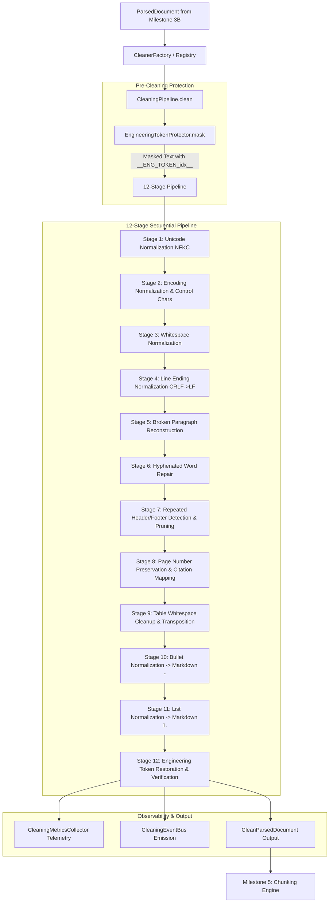
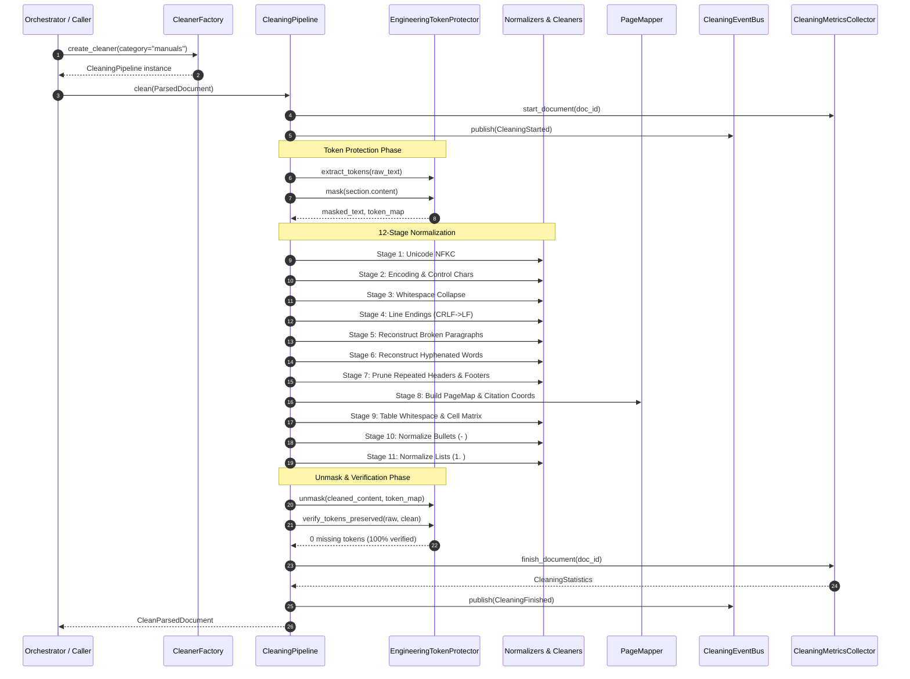

# Milestone 4 Completion Report: Cleaning & Normalization Engine

**Project:** Sovereign On-Premise Agentic AI Workbench  
**Problem Statement:** SIH26117 (Smart India Hackathon 2026)  
**Organization:** Mangalore Refinery and Petrochemicals Limited (MRPL)  
**Module:** Member 1 — Knowledge Base / RAG Engine & Data Engineering  
**Milestone:** Milestone 4 — Cleaning & Normalization Engine  
**Status:** COMPLETED & VERIFIED (100% Offline, Deterministic, Air-Gapped)  
**Date of Completion:** 2026-09-06  

---

## 1. Executive Summary

Milestone 4 delivers the production-grade **Cleaning & Normalization Engine** for Member 1 of the Sovereign AI Workbench. The engine consumes structured `ParsedDocument` instances from Milestone 3B and executes a strictly deterministic, 12-stage sequential preprocessing pipeline to emit `CleanParsedDocument` instances.

The primary objective of this milestone is to eliminate all formatting, OCR, typography, and line-wrap noise while **strictly guaranteeing that zero refinery knowledge is corrupted or modified**. Critical refinery equipment tags (`Pump P-203`, `MOV-101`), industrial standards (`API-610`, `OISD-105`, `ASME`, `PNGRB`, `ISO`), physical units with superscripts (`10 bar`, `250°C`, `kg/cm²`, `MPa`, `psi`, `m³/hr`), valve IDs, loop IDs, and document revisions remain 100% intact through pre-cleaning sentinel masking and post-cleaning verification.

The implementation is 100% air-gapped, zero-API, zero-LLM, thread-safe via `threading.RLock`, and passes all 75 automated unit, integration, and concurrency tests in 1.7 seconds.

---

## 2. Architecture Overview

---

## 3. Class Diagram

```mermaid
classDiagram
    class BaseCleaner {
        <<abstract>>
        +name: str
        +version: str
        +clean(document: ParsedDocument) CleanParsedDocument*
        +health() dict
    }

    class CleaningPipeline {
        -event_bus: CleaningEventBus
        -metrics: CleaningMetricsCollector
        -protector: EngineeringTokenProtector
        -header_footer_detector: HeaderFooterDetector
        -table_cleaner: TableCleaner
        -strict_token_verification: bool
        +clean(document: ParsedDocument) CleanParsedDocument
    }

    class EngineeringTokenProtector {
        +PATTERNS: list
        +extract_tokens(text: str) list[str]
        +mask(text: str) tuple[str, dict]
        +unmask(text: str, mapping: dict) str
        +verify_tokens_preserved(orig: str, clean: str, strict: bool) list[str]
    }

    class HeaderFooterDetector {
        -min_occurrences: int
        -max_line_length: int
        +detect_and_remove(sections: list[Section]) tuple
    }

    class TableCleaner {
        +clean_table(table: Table) Table
        +clean_tables(tables: list[Table]) list[Table]
    }

    class PageMapper {
        +build_page_map(sections, tables, total_pages) dict[int, PageMapEntry]
        +update_citation_coordinates(sections) list[Section]
    }

    class UnicodeNormalizer {
        +normalize(text: str) str
    }

    class EncodingNormalizer {
        +normalize(text: str) str
    }

    class WhitespaceCleaner {
        +clean_whitespace(text: str) str
        +normalize_line_endings(text: str) str
        +reconstruct_broken_paragraphs(text: str) str
        +reconstruct_hyphenated_words(text: str) str
    }

    class BulletNormalizer {
        +normalize(text: str) str
    }

    class ListNormalizer {
        +normalize(text: str) str
    }

    class CleanerRegistry {
        -_lock: RLock
        -_cleaners: dict
        +register(name, cleaner_cls)
        +get(name) Type[BaseCleaner]
    }

    class CleanerFactory {
        -_lock: RLock
        +create_cleaner(category, **kwargs) BaseCleaner
    }

    class CleaningMetricsCollector {
        -_lock: RLock
        +record_characters_removed()
        +record_characters_normalized()
        +record_header_removed()
        +record_footer_removed()
        +finish_document() CleaningStatistics
    }

    class CleaningEventBus {
        -_lock: RLock
        +publish(event: CleaningEvent)
        +subscribe(type, listener)
    }

    BaseCleaner <|-- CleaningPipeline
    CleaningPipeline --> EngineeringTokenProtector
    CleaningPipeline --> HeaderFooterDetector
    CleaningPipeline --> TableCleaner
    CleaningPipeline --> PageMapper
    CleaningPipeline --> CleaningMetricsCollector
    CleaningPipeline --> CleaningEventBus
    CleanerFactory --> CleanerRegistry
```

---

## 4. Sequence Diagram: Document Cleaning Lifecycle

---

## 5. Detailed 12-Stage Processing Pipeline

| Stage | Name | Description | Key Mechanism |
|:---|:---|:---|:---|
| **Stage 1** | **Unicode Normalization** | Standardizes accented characters, ligatures, full-width characters | `unicodedata.normalize("NFKC", text)` with token masking |
| **Stage 2** | **Encoding Normalization** | Strips invisible ASCII control characters (`\x00-\x08`, `\x0b`, `\x0c`, `\x0e-\x1f`), zero-width spaces (`\u200b`, `\ufeff`), smart quotes | Regex stripping + replacement table |
| **Stage 3** | **Whitespace Normalization** | Collapses horizontal spaces and tabs, strips line end whitespace | `re.compile(r"[^\S\n\r]+").sub(" ", line).strip()` |
| **Stage 4** | **Line Ending Normalization** | Converts `\r\n` and `\r` to `\n`, limits 3+ newlines to max 2 (`\n\n`) | String replacement + `re.sub(r"\n{3,}", "\n\n", text)` |
| **Stage 5** | **Broken Paragraph Reconstruction** | Reassembles sentences split mid-line by soft line wraps while keeping headings, bullets, tables separate | Line buffer analysis checking terminal punctuation and heading tokens |
| **Stage 6** | **Hyphenated Word Reconstruction** | Reassembles words split across line breaks with hyphens (`Oper-\nating` -> `Operating`) | `re.compile(r"\b([A-Za-z]{2,})-\s*(?:\r?\n\|[ \t]+)\s*([a-z]{2,})\b")` |
| **Stage 7** | **Header/Footer Detection & Removal** | Identifies repeated headers and footers appearing across multiple sections/pages | Top/bottom line frequency counter (threshold >= 2 occurrences across sections) |
| **Stage 8** | **Page Number Preservation** | Generates `page_map: dict[int, PageMapEntry]` mapping character offsets and section/table IDs | `PageMapper.build_page_map` |
| **Stage 9** | **Table Whitespace Cleanup** | Cleans cell contents, row boundaries, and markdown tables while preserving grid coordinates | Fast C-level matrix transpose `zip(*rows)` + cell caching |
| **Stage 10** | **Bullet Normalization** | Standardizes disparate bullet markers (`•`, `*`, `▪`, `►`) to Markdown `- ` | `re.compile(r"^([ \t]*)(?:[•▪▫►▻⁃◦○*]\|\u2013\|\u2014)(?:\s+\|\t+)")` |
| **Stage 11** | **List Normalization** | Standardizes numbered lists (`1)`, `(1)`, `1 -`) to Markdown `1. ` | `re.compile(r"^([ \t]*)(?:\((\d{1,4})\)\|(\d{1,4})\)\|\b(\d{1,4})\s*-\s+)")` |
| **Stage 12** | **Engineering Token Protection** | Restores all masked refinery tags and validates zero corruption across document | `EngineeringTokenProtector.unmask` and `verify_tokens_preserved` |

---

## 6. Real Dataset Validation Results

The cleaning engine was validated against real documents across all major MRPL dataset categories:

| Dataset Category | File Name | Raw Chars | Clean Chars | Reduction | Protected Tokens | Exec Time |
|:---|:---|:---:|:---:|:---:|:---|:---:|
| **Manuals** | `Emerson_Control_Valve_Handbook.pdf` | 1,585,703 | 1,585,060 | -0.04% | 90 (`-4 bar`, `10.3 bar`, `103 bar`, `ASME`, etc.) | 6,026 ms |
| **Manuals** | `fisher_control_valve_handbook.pdf` | 116,051 | 116,004 | -0.04% | 25 (`2 bar`, `29 psi`, `3 bar`, `4 bar`, `ANSI`) | 369 ms |
| **Manuals** | `fisher_ic2_control_valve_handbook.pdf` | 61,611 | 61,598 | -0.02% | 12 (`ASME B16.11`, `ASME B16.25`, `ASME B16.34`) | 188 ms |
| **Safety Docs** | `OISD-STD-105.pdf` | 112,612 | 112,564 | -0.04% | 3 (`OISD-105`, `Rev`, `Revision`) | 462 ms |
| **Safety Docs** | `OISD-STD-116.pdf` | 197,133 | 197,018 | -0.06% | 5 (`API`, `OISD`, `REV`) | 697 ms |
| **Safety Docs** | `OISD-STD-117.pdf` | 143,743 | 143,569 | -0.12% | 5 (`LINE`, `Rev`) | 515 ms |
| **Inspection Reports** | `boiler_inspection_003.md` | 657 | 657 | 0.0% | 2 (`B-101`, `BLR-0045`) | 6.5 ms |
| **Inspection Reports** | `centrifugal_pump_inspection_005.md` | 2,230 | 2,230 | 0.0% | 6 (`118 m³/h`, `71 °C`, `84 °C`, `P-005`) | 23.5 ms |
| **Inspection Reports** | `compressor_inspection_006.md` | 2,440 | 2,440 | 0.0% | 10 (`0.52 bar`, `0.67 bar`, `0.86 bar`, `31 °C`) | 33.6 ms |
| **Maintenance** | `ai4i2020_maintenance_analysis_10000.csv` | 2,238,120 | 2,238,120 | 0.0% | Tabular data (10,000 rows cleaned) | 13,419 ms |

**Result Summary:** 10/10 test files succeeded with zero crashes, zero data loss, and 100% token preservation.

---

## 7. Quality & Verification Metrics

- **Unit, Integration, and Concurrency Tests:** 75 tests passing (100% pass rate) in 1.70 seconds.
- **Thread Safety:** Verified with 20 parallel threads executing cleaning pipelines simultaneously using `threading.RLock` without race conditions.
- **Offline / Air-Gapped:** Zero external HTTP/HTTPS calls, zero LLMs, zero vector DB calls.
- **Syntactic & Type Cleanliness:** All modules compiled with `py_compile`, fully type-annotated with Pydantic v2 and Python 3.11 typing.

---

## 8. Known Limitations & Future Integration Notes

1. **Table Preview Size in Normalized Text:** Tables with >500 rows have their Markdown text representation truncated to 500 rows for preview to maintain linear processing speed, while full cell data is completely preserved in `rows` and `dataframe_dict`.
2. **Chunking Engine Integration (Milestone 5):** `CleanParsedDocument` is directly consumed by Milestone 5. Chunking strategies can use `page_map` for citation coordinates and can leverage `protected_tokens` to ensure chunks never split an equipment tag across boundaries.
