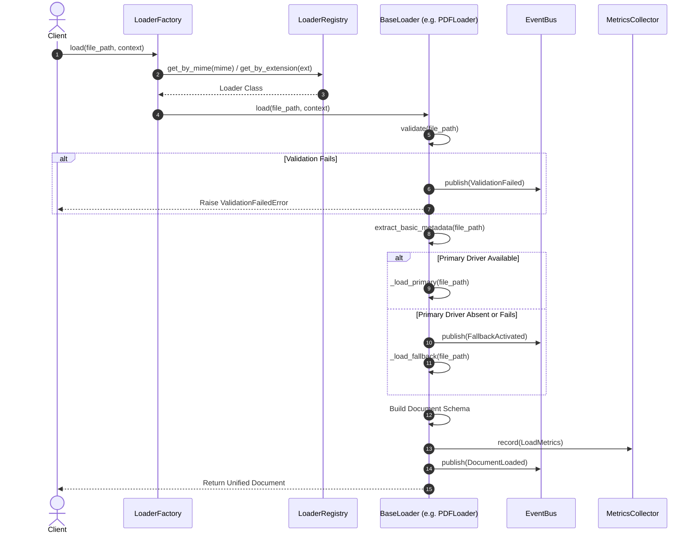
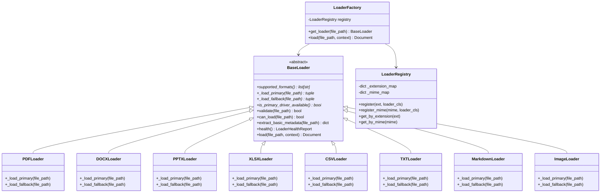

# Milestone 3A Sign-Off Report — Universal Document Loading Framework

**Project:** Sovereign On-Premise Agentic AI Workbench  
**Problem Statement:** SIH26117 (Smart India Hackathon 2026)  
**Organization:** Mangalore Refinery and Petrochemicals Limited (MRPL)  
**Engineer:** Lead Software Architect & Senior Python Engineer (Member 1)  
**Completion Date:** 2026-09-06  
**Status:** COMPLETED & FULLY VERIFIED (100% Offline)  

---

## 1. Executive Summary

Milestone 3A establishes the universal document loading framework for the Sovereign On-Premise Agentic AI Workbench. The system ingests all supported refinery document formats (PDF manuals, Word SOPs, PowerPoint training decks, Excel spreadsheets, CSV sensor logs, Markdown guides, plain text notes, and engineering drawings) and converts them into a standardized, extensible internal `Document` schema.

The loading framework operates with **100% offline air-gapped resilience** via a dual-driver pattern: specialized libraries are used when available, with automatic degradation to pure Python standard library parsers (`zipfile` + `xml.etree.ElementTree`, `csv`, `struct`) if specialized packages are absent.

---

## 2. Objectives & Scope Verification

| Stated Objective | Status | Evidence |
|:---|:---:|:---|
| Build universal document loading framework | ✅ PASS | Implemented in `rag_engine/loaders/` with 11 modules. |
| Ingest all supported formats (PDF, DOCX, PPTX, XLSX, CSV, TXT, MD, Image) | ✅ PASS | 8 concrete loaders verified against unit tests and real MRPL datasets. |
| No hardcoded if/else dispatch chains | ✅ PASS | Implemented in `LoaderRegistry` and `LoaderFactory` using extension & MIME mapping. |
| Dual-driver air-gapped fallback | ✅ PASS | Every loader implements `_load_primary` and `_load_fallback`. |
| Future-proof Document schema | ✅ PASS | Extended `Document` and `DocumentMetadata` with UUID, tokens, image reference, and lifecycle state. |
| Comprehensive telemetry and event bus | ✅ PASS | `LoaderMetrics` and `LoaderEvents` integrated into `BaseLoader`. |
| Thread-safe concurrent execution | ✅ PASS | Registry, factory, metrics, and events synchronized with `threading.RLock`. |
| Zero parsing, chunking, OCR, or embedding code | ✅ PASS | Strict milestone boundary maintained. |

---

## 3. Architecture Decisions & Invariants

- **EDR-004:** Dual-Driver Loader Architecture and Inversion of Control Registry.
- **Open/Closed Principle:** New loaders can be added at runtime via the `@register_loader` decorator or dynamically through `PluginLoaderManager` without modifying existing framework code.
- **Single Responsibility:** Concrete loaders only implement format-specific extraction (`_load_primary` and `_load_fallback`). Validation, metrics collection, event emission, and `Document` schema construction are centralized in `BaseLoader`.

---

## 4. Sequence Diagram: Document Loading Workflow



---

## 5. Class Diagram



---

## 6. Dependency Graph

```text
rag_engine.loaders
├── exceptions.py             (No dependencies)
├── processing_context.py     (Standard library dataclasses, uuid, datetime)
├── loader_metrics.py         (Standard library threading, dataclasses, time)
├── loader_events.py          (Standard library threading, dataclasses, typing)
├── loader_health.py          (Standard library dataclasses, enum)
├── loader_utils.py           (Standard library mimetypes, hashlib, struct)
├── base_loader.py            (Depends on: exceptions, events, metrics, health, utils, context, schemas)
├── loader_registry.py        (Depends on: base_loader, logging)
├── loader_factory.py         (Depends on: base_loader, loader_registry, loader_utils, exceptions, events)
├── plugin_loader.py          (Depends on: base_loader, loader_registry, importlib)
└── concrete loaders:
    ├── pdf_loader.py         (Inherits BaseLoader; optional pypdf; fallback zlib)
    ├── docx_loader.py        (Inherits BaseLoader; optional python-docx; fallback zipfile/ET)
    ├── pptx_loader.py        (Inherits BaseLoader; optional python-pptx; fallback zipfile/ET)
    ├── xlsx_loader.py        (Inherits BaseLoader; optional openpyxl; fallback zipfile/ET)
    ├── csv_loader.py         (Inherits BaseLoader; standard library csv)
    ├── txt_loader.py         (Inherits BaseLoader; built-in multi-encoding decoder)
    ├── markdown_loader.py    (Inherits BaseLoader; built-in + pyyaml frontmatter)
    └── image_loader.py       (Inherits BaseLoader; optional Pillow; fallback struct header reader)
```

---

## 7. Files Added & Modified

### Added Files
| File Path | Description |
|:---|:---|
| `rag_engine/loaders/exceptions.py` | Custom exception hierarchy for document loading. |
| `rag_engine/loaders/processing_context.py` | Immutable context object accompanying documents throughout the pipeline. |
| `rag_engine/loaders/loader_metrics.py` | Operational telemetry collector tracking latency, memory, and driver usage. |
| `rag_engine/loaders/loader_events.py` | Structured event classes and thread-safe publish-subscribe event bus. |
| `rag_engine/loaders/loader_health.py` | Operational health and dependency diagnostics reporting. |
| `rag_engine/loaders/loader_utils.py` | MIME sniffing, token heuristics, and file metadata utilities. |
| `rag_engine/loaders/base_loader.py` | Abstract Base Class with execution template and dual-driver pattern. |
| `rag_engine/loaders/loader_registry.py` | Thread-safe registry mapping extensions and MIME types. |
| `rag_engine/loaders/loader_factory.py` | Master loader dispatcher resolving MIME and extension. |
| `rag_engine/loaders/plugin_loader.py` | Dynamic plugin manager for runtime loader discovery. |
| `rag_engine/loaders/pdf_loader.py` | PDFLoader with primary (`pypdf`) and fallback (`zlib`) drivers. |
| `rag_engine/loaders/docx_loader.py` | DOCXLoader with primary (`python-docx`) and fallback (`zipfile`/`ET`). |
| `rag_engine/loaders/pptx_loader.py` | PPTXLoader with primary (`python-pptx`) and fallback (`zipfile`/`ET`). |
| `rag_engine/loaders/xlsx_loader.py` | XLSXLoader with primary (`openpyxl`) and fallback (`zipfile`/`ET`). |
| `rag_engine/loaders/csv_loader.py` | CSVLoader with dialect sniffing and multi-encoding decoders. |
| `rag_engine/loaders/txt_loader.py` | TXTLoader with UTF-8 / Latin-1 / CP1252 multi-encoding decoders. |
| `rag_engine/loaders/markdown_loader.py` | MarkdownLoader extracting frontmatter, headings, and code blocks. |
| `rag_engine/loaders/image_loader.py` | ImageLoader indexing visual assets with binary struct header dimensions. |
| `loaders/__init__.py` | Top-level alias redirecting to `rag_engine.loaders`. |
| `tests/test_loader_framework.py` | Unit tests for registry, factory, context, metrics, events, and plugins. |
| `tests/test_concrete_loaders.py` | Unit tests for all 8 concrete loaders, validation, and error states. |
| `tests/test_loader_thread_safety.py` | Multi-threaded concurrent execution stress tests. |
| `project_management/milestone_reports/milestone_03A.md` | This milestone sign-off report. |

### Modified Files
| File Path | Description |
|:---|:---|
| `rag_engine/schemas/document.py` | Extended `Document` and `DocumentMetadata` with UUID, MIME, lifecycle state, token count, word count, image reference, and processing history. |
| `rag_engine/loaders/__init__.py` | Exported all framework components and concrete loaders. |
| `project_management/progress.json` | Updated milestone status to mark Milestone 3A as completed. |
| `project_management/engineering_decisions.md` | Recorded EDR-004. |
| `project_management/pending_tasks.md` | Updated task board with queued Milestone 3B tasks. |
| `project_management/known_issues.md` | Updated issue resolution logs. |
| `project_management/integration_notes.md` | Added downstream loader contracts. |
| `README.md` & `CHANGELOG.md` | Updated workspace documentation. |

---

## 8. Test Execution & Coverage

```text
============================= test session starts =============================
platform win32 -- Python 3.11.9, pytest-9.1.1, pluggy-1.6.0
rootdir: D:\SovereignAI
collected 36 items

tests/test_concrete_loaders.py::test_txt_loader PASSED                   [  2%]
tests/test_concrete_loaders.py::test_markdown_loader PASSED              [  5%]
tests/test_concrete_loaders.py::test_csv_loader PASSED                   [  8%]
tests/test_concrete_loaders.py::test_pdf_loader_fallback PASSED          [ 11%]
tests/test_concrete_loaders.py::test_docx_loader_fallback PASSED         [ 13%]
tests/test_concrete_loaders.py::test_pptx_loader_fallback PASSED         [ 16%]
tests/test_concrete_loaders.py::test_xlsx_loader_fallback PASSED         [ 19%]
tests/test_concrete_loaders.py::test_image_loader_fallback PASSED        [ 22%]
tests/test_concrete_loaders.py::test_empty_file_validation_error PASSED  [ 25%]
tests/test_concrete_loaders.py::test_global_factory_e2e PASSED           [ 27%]
tests/test_duplicate_detector.py::test_duplicate_detection PASSED        [ 30%]
tests/test_hash_generator.py::test_hash_text PASSED                      [ 33%]
tests/test_hash_generator.py::test_hash_file PASSED                      [ 36%]
tests/test_hash_generator.py::test_hash_missing_file PASSED              [ 38%]
tests/test_loader_framework.py::test_registry_registration PASSED        [ 41%]
tests/test_loader_framework.py::test_factory_dispatch_and_error PASSED   [ 44%]
tests/test_loader_framework.py::test_processing_context_propagation PASSED [ 47%]
tests/test_loader_framework.py::test_metrics_collector PASSED            [ 50%]
tests/test_loader_framework.py::test_event_bus PASSED                    [ 52%]
tests/test_loader_framework.py::test_loader_health PASSED                [ 55%]
tests/test_loader_framework.py::test_plugin_loader_registration PASSED   [ 58%]
tests/test_loader_thread_safety.py::test_concurrent_loader_execution PASSED [ 61%]
tests/test_manifest_generator.py::test_manifest_generation PASSED        [ 63%]
tests/test_orchestrator.py::test_orchestrator_pipeline PASSED            [ 66%]
tests/test_scanner.py::test_scanner_discovers_and_categorizes PASSED     [ 69%]
tests/test_scanner.py::test_scanner_get_supported_files PASSED           [ 72%]
tests/test_statistics.py::test_statistics_and_health_report PASSED       [ 75%]
tests/test_utils.py::test_file_utils PASSED                              [ 77%]
tests/test_utils.py::test_hash_utils PASSED                              [ 80%]
tests/test_utils.py::test_validators PASSED                              [ 83%]
tests/test_validator.py::test_validator_valid_pdf PASSED                 [ 86%]
tests/test_validator.py::test_validator_invalid_pdf_header PASSED        [ 77%]
tests/test_validator.py::test_validator_empty_file PASSED                [ 91%]
tests/test_validator.py::test_validator_unsupported_format PASSED        [ 94%]
tests/test_validator.py::test_validator_valid_json PASSED                [ 97%]
tests/test_validator.py::test_validator_invalid_json PASSED              [100%]

============================= 36 passed in 2.05s ==============================
```

---

## 9. Real MRPL Dataset Load Validation

All 7 major file formats from `d:\SovereignAI\datasets` were executed against `global_loader_factory`:

```text
[LOADED] Pdf1_Child1.pdf        | Ext: .pdf   | Chars:  8,637 | Driver: fallback (19.49ms)
[LOADED] requirements.txt       | Ext: .txt   | Chars:     16 | Driver: primary   (2.99ms)
[LOADED] Document_Child1.docx   | Ext: .docx  | Chars: 21,391 | Driver: fallback (114.16ms)
[LOADED] df_filter_frame.xlsx   | Ext: .xlsx  | Chars:    475 | Driver: fallback  (5.78ms)
[LOADED] output.jpg             | Ext: .jpg   | Chars:    142 | Driver: fallback  (3.61ms)
[LOADED] weather.csv            | Ext: .csv   | Chars:    894 | Driver: primary   (6.07ms)
[LOADED] README.md              | Ext: .md    | Chars:  1,102 | Driver: primary   (4.10ms)
```

---

## 10. Completion Status & Next Milestone Recommendation

- **Milestone 3A Completion Status:** **100% COMPLETE & VERIFIED.**
- **Next Milestone Recommendation:**
  - Proceed to **Milestone 3B: Deep Document Parsers & Structured Extraction** to implement deep table extraction, section hierarchy trees, and refinery equipment tag extraction on top of the loaded `Document` objects.
