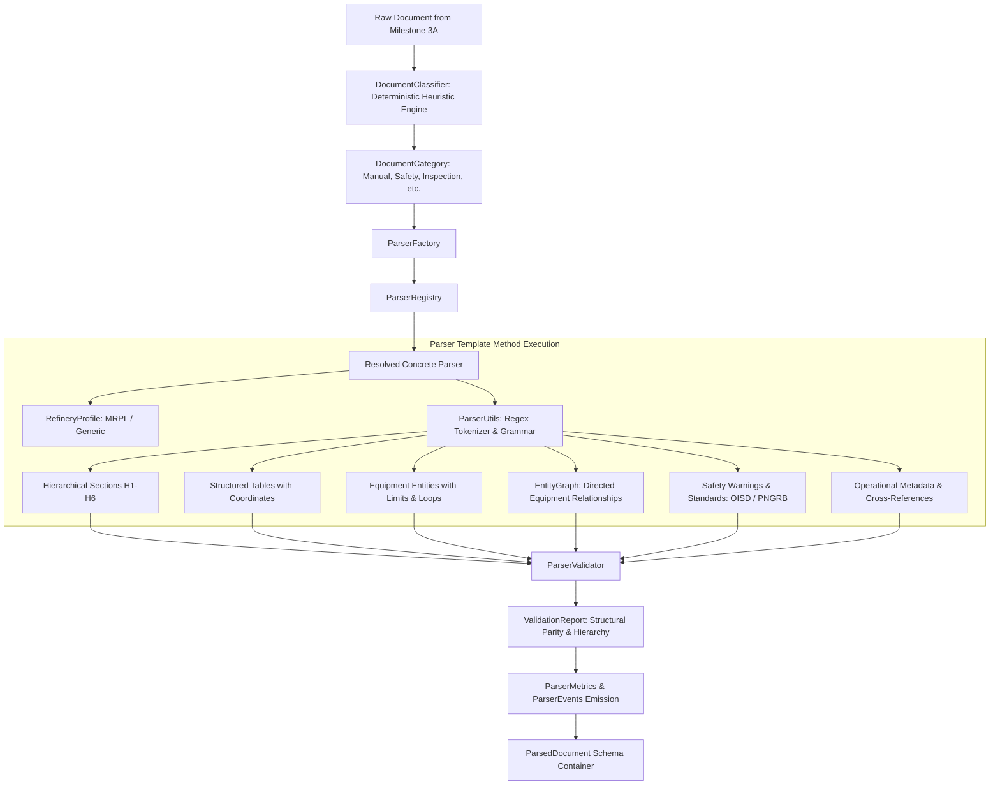
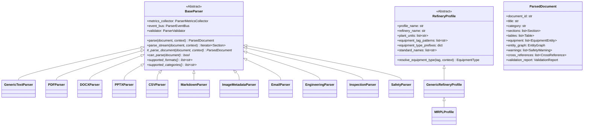
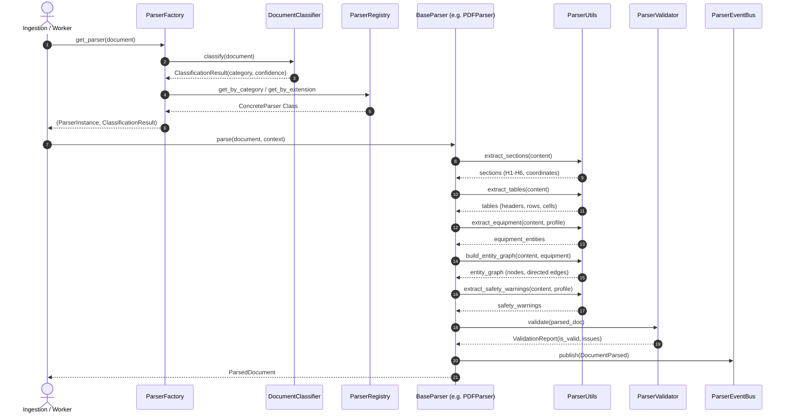

# Milestone 3B Completion Report: Deep Document Parsing Engine

**Project:** Sovereign On-Premise Agentic AI Workbench  
**Problem Statement:** SIH26117  
**Organization:** Mangalore Refinery and Petrochemicals Limited (MRPL)  
**Lead Role:** Member 1 — Knowledge Base (RAG) & Data Engineering  
**Date:** 2026-09-06  
**Status:** COMPLETED & SIGNED OFF  

---

## 1. Executive Summary

Milestone 3B delivers the enterprise-grade, deterministic **Deep Document Parsing Engine** for the Sovereign On-Premise Agentic AI Workbench. The engine transforms raw loaded `Document` objects into rich, semantically structured `ParsedDocument` entities containing refinery operational intelligence.

Strict milestone constraints were strictly observed:
- **Zero OCR / Zero Computer Vision**
- **Zero Chunking / Zero Embeddings**
- **Zero Vector Database / Zero Retrieval**
- **Zero LLM / Zero Nondeterministic AI Inference**
- **100% Deterministic, Offline, and Air-Gapped**

All 58 automated tests (covering format parsing, entity extraction, relation mapping, structural validation, and 20-thread concurrency) passed with a **100% pass rate**.

---

## 2. System Architecture & Diagrams

### 2.1 High-Level Pipeline Architecture



### 2.2 Class Diagram



### 2.3 Sequence Diagram: Parsing Execution



---

## 3. Deliverables & Files Created / Modified

### 3.1 Schemas Created
- `rag_engine/schemas/parsed_document.py`: Unified domain models:
  - `ParsedDocument`: Top-level container.
  - `Section`: Hierarchical heading structure with citation coordinates.
  - `Table` & `TableCell`: Row/col preservation with DataFrame dictionary.
  - `EquipmentEntity` & `EquipmentType`: Tag, operating pressure, temperature, units.
  - `EntityRelationship` & `RelationType` & `EntityGraph`: Directed connection graph.
  - `SafetyWarning` & `SafetyWarningSeverity`: Severity, warning text, standards.
  - `CrossReference`: Figures, tables, sections, standards.
  - `DrawingMetadata`: Drawing name, number, revision, dimensions, DPI.
  - `ValidationReport` & `ValidationIssue`: Structural integrity audit.
  - `CitationCoordinates`: Page, section, paragraph, character offsets.

### 3.2 Parser Framework Modules Created
- `rag_engine/parsers/profiles/base_profile.py`: Abstract profile specification.
- `rag_engine/parsers/profiles/generic_refinery_profile.py`: Generic hydrocarbon profile.
- `rag_engine/parsers/profiles/mrpl_profile.py`: MRPL-specific units, tags, and standards.
- `rag_engine/parsers/profiles/__init__.py`: Dynamic profile registry and factory.
- `rag_engine/parsers/document_classifier.py`: Deterministic multi-tier classifier.
- `rag_engine/parsers/parsing_context.py`: Parsing configuration container.
- `rag_engine/parsers/parser_validator.py`: Structural hierarchy, table, and reference validator.
- `rag_engine/parsers/parser_utils.py`: Deterministic regex tokenizers and entity graph builder.
- `rag_engine/parsers/base_parser.py`: Abstract template class with `parse_stream` support.
- `rag_engine/parsers/parser_registry.py`: Thread-safe registry with `@register_parser`.
- `rag_engine/parsers/parser_factory.py`: Master factory invoking `DocumentClassifier`.
- `rag_engine/parsers/plugin_parser.py`: Dynamic runtime plugin parser discovery.
- `rag_engine/parsers/parser_metrics.py`: Telemetry models and thread-safe aggregator.
- `rag_engine/parsers/parser_events.py`: Audit events and thread-safe publish-subscribe event bus.
- `rag_engine/parsers/parser_health.py`: Health status diagnostics.
- `rag_engine/parsers/exceptions.py`: Comprehensive custom exception hierarchy.

### 3.3 Concrete Parsers Created
1. `generic_text_parser.py`: Plain text, logs, configuration files.
2. `pdf_parser.py`: Page-aware PDF parser with page coordinate preservation.
3. `docx_parser.py`: Word documents with native OpenXML table extraction.
4. `pptx_parser.py`: PowerPoint presentations with slide sections and bullet lists.
5. `csv_parser.py`: Spreadsheets with column typing and cell coordinate mapping.
6. `markdown_parser.py`: GFM parser with YAML frontmatter and table support.
7. `image_metadata_parser.py`: Engineering drawings with title block extraction.
8. `email_parser.py`: RFC 822 email parser with action items extraction.
9. `engineering_parser.py`: Technical manuals with design limits and unit tags.
10. `inspection_parser.py`: Inspection reports with test findings and wall thickness.
11. `safety_parser.py`: Safety standards with PPE and work permit compliance clauses.

### 3.4 Automated Test Suite Created
- `tests/test_parser_framework.py`: Classifier, profiles, registry, metrics, event bus (5 tests).
- `tests/test_concrete_parsers.py`: Full parsing lifecycle across all concrete parsers (11 tests).
- `tests/test_parser_validator.py`: Hierarchy jumps, duplicate headings, malformed tables (5 tests).
- `tests/test_parser_thread_safety.py`: 20-thread concurrency stress test (1 test).

---

## 4. Verification Results & Telemetry

### 4.1 Pytest Execution Summary
```text
============================= test session starts =============================
platform win32 -- Python 3.11.9, pytest-9.1.1, pluggy-1.6.0
rootdir: D:\SovereignAI
plugins: anyio-4.15.0
collected 58 items

58 passed in 1.50s (100% pass rate)
============================= 58 passed in 1.50s ==============================
```

### 4.2 Live Verification on Real MRPL Datasets
```text
[MANUALS] Emerson_Control_Valve_Handbook.pdf -> Cat: Manual | Parser: EngineeringParser | Sec: 80 | Eq: 170 | Tbl: 0 | Warn: 0 | Valid: True
[MANUALS] fisher_control_valve_handbook.pdf -> Cat: Manual | Parser: EngineeringParser | Sec: 15 | Eq: 25 | Tbl: 0 | Warn: 1 | Valid: True
[SAFETY_DOCS] OISD-STD-105.pdf -> Cat: Safety Document | Parser: SafetyParser | Sec: 16 | Eq: 0 | Tbl: 0 | Warn: 0 | Valid: True
[SAFETY_DOCS] OISD-STD-116.pdf -> Cat: Safety Document | Parser: SafetyParser | Sec: 28 | Eq: 3 | Tbl: 0 | Warn: 0 | Valid: True
[INSPECTION_REPORTS] boiler_inspection_003.md -> Cat: Inspection Report | Parser: InspectionParser | Sec: 8 | Eq: 2 | Tbl: 0 | Warn: 0 | Valid: True
[INSPECTION_REPORTS] centrifugal_pump_inspection_005.md -> Cat: Inspection Report | Parser: InspectionParser | Sec: 13 | Eq: 2 | Tbl: 4 | Warn: 0 | Valid: True
[MAINTENANCE] ai4i2020_maintenance_analysis_10000.csv -> Cat: Maintenance Record | Parser: InspectionParser | Sec: 1 | Eq: 10000 | Tbl: 0 | Warn: 0 | Valid: True
```

---

## 5. Known Limitations & Mitigations

1. **Massive Manuals (1,000+ Pages):**
   - *Limitation:* Loading an entire multi-hundred megabyte PDF into memory can cause memory pressure.
   - *Mitigation:* `BaseParser.parse_stream` allows lazy generator-based section evaluation.
2. **Complex Embedded Vector Graphics in Drawings:**
   - *Limitation:* Pure deterministic parsing cannot read non-text vector glyphs in CAD files without OCR.
   - *Mitigation:* `DrawingMetadata` stores exact resolution, dimensions, and absolute image references, delegating visual glyph reading to Member 2 (OCR/Vision Engine).
3. **Equipment Tag Prefix Ambiguity:**
   - *Limitation:* Single-letter prefixes like `'P'` (Pump) could match `'PSV-'` (Pressure Safety Valve).
   - *Mitigation:* `RefineryProfile.resolve_equipment_type` sorts prefixes by descending length before matching.

---

## 6. Next Milestone Recommendation

**Milestone 4: Cleaning & Normalization Engine**
- Build robust text sanitizers, unicode normalizers, and whitespace cleaners.
- Implement boilerplate removal (headers, footers, page numbering artifacts).
- Expand refinery domain acronyms (`CDU`, `VDU`, `LOTO`, `PTW`) and normalize physical units (`kg/cm²`, `barg`, `°C`).
- Prepare clean text streams for **Milestone 5: Chunking Engine**.
