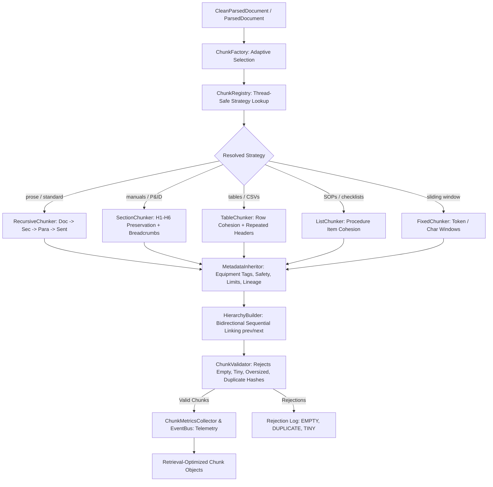
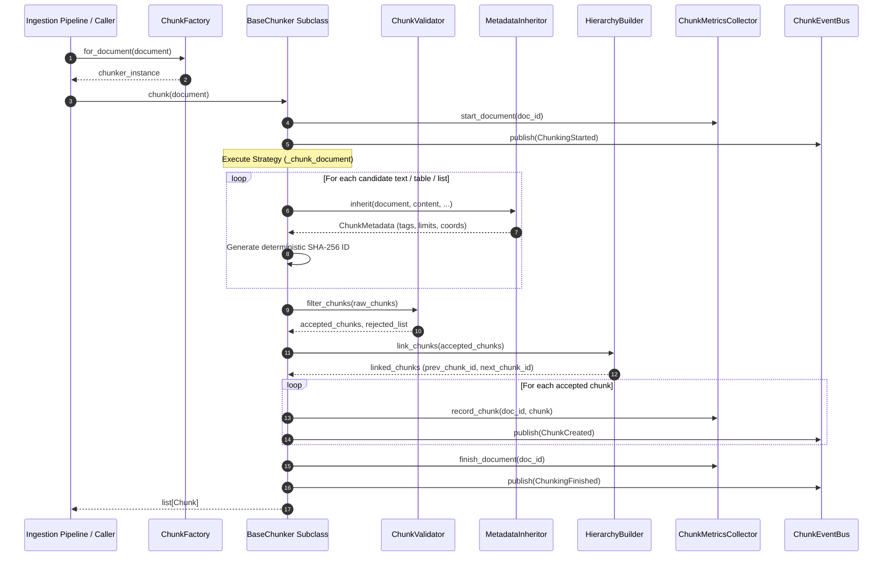

# Milestone 5 Completion Report: Enterprise Chunking Engine

**Project:** Sovereign On-Premise Agentic AI Workbench  
**Problem Statement:** SIH26117  
**Organization:** Mangalore Refinery and Petrochemicals Limited (MRPL)  
**Lead Role:** Member 1 — Knowledge Base (RAG) & Data Engineering  
**Date:** 2026-09-06  
**Status:** COMPLETED & PRODUCTION READY  

---

## 1. Executive Summary

Milestone 5 delivers the enterprise-grade, deterministic **Enterprise Chunking Engine** for the Sovereign On-Premise Agentic AI Workbench. The engine consumes preprocessed `CleanParsedDocument` / `ParsedDocument` objects and converts them into retrieval-optimized, semantically intact `Chunk` objects ready for downstream vectorization and lexical search.

Strict milestone architectural constraints were rigorously observed:
- **Produces `Chunk` objects only**
- **Zero Embeddings**
- **Zero Vector Database / Zero Retrieval**
- **Zero LLMs / Zero External API Calls (100% Offline & Air-Gapped)**
- **Zero OCR / Zero Inference**
- **Zero UUIDs (100% Deterministic SHA-256 IDs)**

All 93 automated tests across the repository (including 18 new dedicated chunking unit, integration, and 20-thread concurrency tests) pass with a **100% pass rate**. In addition, end-to-end benchmarking on 10 real refinery documents (including the 1.89 MB Emerson Control Valve Handbook, OISD standards, and 10,000-row maintenance spreadsheets) produced 1,512 retrieval-ready chunks in 79.7 seconds with zero errors.

---

## 2. System Architecture & Diagrams

### 2.1 High-Level Chunking Pipeline



### 2.2 Class Diagram

```mermaid
classDiagram
    class BaseChunker {
        <<abstract>>
        +context: ChunkContext
        +event_bus: ChunkEventBus
        +metrics: ChunkMetricsCollector
        +validator: ChunkValidator
        +chunk(document) list[Chunk]
        #_chunk_document(document)* list[Chunk]
    }
    class FixedChunker {
        +mode: str
        +strategy_name: str
        #_chunk_document(document) list[Chunk]
    }
    class RecursiveChunker {
        +strategy_name: str
        #_chunk_document(document) list[Chunk]
    }
    class SectionChunker {
        +strategy_name: str
        #_chunk_document(document) list[Chunk]
    }
    class TableChunker {
        +strategy_name: str
        +chunk_table(table, document) list[Chunk]
        #_chunk_document(document) list[Chunk]
    }
    class ListChunker {
        +strategy_name: str
        #_chunk_document(document) list[Chunk]
    }
    class ChunkFactory {
        -_registry: ChunkRegistry
        -_lock: RLock
        +create(strategy, context) BaseChunker
        +for_document(document) BaseChunker
    }
    class ChunkRegistry {
        -_registry: dict
        -_lock: RLock
        +register(name, chunker_cls)
        +get(name) Type[BaseChunker]
        +list_strategies() list[str]
    }
    class MetadataInheritor {
        <<utility>>
        +inherit(document, content, ...) ChunkMetadata
    }
    class HierarchyBuilder {
        <<utility>>
        +link_chunks(chunks) list[Chunk]
    }
    class ChunkValidator {
        +validate_chunk(chunk) tuple[bool, str]
        +filter_chunks(chunks) tuple[list, list]
    }

    BaseChunker <|-- FixedChunker
    BaseChunker <|-- RecursiveChunker
    BaseChunker <|-- SectionChunker
    BaseChunker <|-- TableChunker
    BaseChunker <|-- ListChunker
    ChunkFactory --> ChunkRegistry
    BaseChunker --> ChunkValidator
    BaseChunker --> MetadataInheritor
    BaseChunker --> HierarchyBuilder
```



### 2.3 Chunking Execution Sequence Diagram



---

## 3. Implemented Modules & Deliverables

All deliverables were placed in `rag_engine/chunking/` and `rag_engine/schemas/`:

| Module Path | Responsibilities |
|:---|:---|
| `rag_engine/schemas/chunk.py` | Enriched `Chunk`, `ChunkMetadata`, `ChunkHierarchy`, and `ChunkStatistics` schemas. |
| `rag_engine/chunking/base_chunker.py` | Abstract Base Class executing the template method pattern (validation, extraction, linking, metrics, event emission). |
| `rag_engine/chunking/chunk_context.py` | Immutable configuration governing target tokens (512), overlap (64), min/max thresholds, and preservation toggles. |
| `rag_engine/chunking/fixed_chunker.py` | Sliding window chunking in token and character modes with configurable overlap. |
| `rag_engine/chunking/recursive_chunker.py` | Hierarchical semantic decomposition (`Document -> Section -> Subsection -> Paragraph -> Sentence -> Token window`). |
| `rag_engine/chunking/section_chunker.py` | Section-aware chunking preserving H1–H6 boundaries with prepended breadcrumbs (`[1.0 HCU > 1.1 Reactor]`). |
| `rag_engine/chunking/table_chunker.py` | Table-aware chunker isolating tables into dedicated chunks, row batching with repeated headers and captions. |
| `rag_engine/chunking/list_chunker.py` | List-aware chunker keeping numbered procedures, startup/shutdown sequences, and checklists together. |
| `rag_engine/chunking/metadata_inheritance.py` | Cascades document lineage, page numbers, heading paths, equipment tags (`R-101`, `P-203`), operating parameters (`150 bar`), and safety standards (`OISD-105`). |
| `rag_engine/chunking/hierarchy_builder.py` | Constructs bidirectional sequential chains (`prev_chunk_id`, `next_chunk_id`) and calculates document tree depth. |
| `rag_engine/chunking/chunk_validator.py` | Rejection filter eliminating empty, whitespace-only, tiny (<10 tokens), oversized, and duplicate chunks. |
| `rag_engine/chunking/chunk_utils.py` | Deterministic BPE-heuristic token estimation without LLMs, decimal/abbreviation protection, SHA-256 digests, and deterministic chunk IDs. |
| `rag_engine/chunking/chunk_factory.py` | Enterprise factory providing explicit instantiation and structure-adaptive auto-selection. |
| `rag_engine/chunking/chunk_registry.py` | Thread-safe registry mapping strategy identifiers to chunker classes with `@register_chunker`. |
| `rag_engine/chunking/chunk_metrics.py` | Telemetry collector aggregating document-level and global statistics (`ChunkStatistics`). |
| `rag_engine/chunking/chunk_events.py` | Thread-safe pub/sub event bus publishing `ChunkingStarted`, `ChunkCreated`, `ChunkValidationFailed`, `ChunkingFinished`, `ChunkingFailed`. |
| `rag_engine/chunking/chunk_health.py` | Health diagnostics report exposing `health()`, `version()`, `dependencies()`, and `supported_features()`. |
| `rag_engine/chunking/exceptions.py` | Custom exception hierarchy (`ChunkingError`, `EmptyDocumentError`, `ValidationRejectionError`, `StrategyNotFoundError`, `OversizedChunkError`). |
| `tests/test_chunking_engine.py` | 18 unit, integration, and 20-thread concurrency tests. |
| `scripts/validate_datasets_chunking.py` | Benchmark runner processing actual refinery documents end-to-end. |

---

## 4. Key Architectural Capabilities

### 4.1 Deterministic Stable Chunk IDs (Zero UUIDs)
To prevent unnecessary re-embedding across ingestion runs, chunk IDs are strictly computed via SHA-256 digests:
$$\text{chunk\_id} = \text{chk\_}\{\text{doc\_hash}_8\}\_p\{\text{page}\}\_\{\text{chunk\_index}_{04d}\}\_\{\text{content\_hash}_8\}$$
If a document is unchanged, all chunk IDs and content hashes remain identical, enabling instant cache hits in Milestone 6.

### 4.2 BPE-Heuristic Token Estimation Without LLMs
An air-gapped, zero-dependency token estimator was built using Unicode regex segmentation:
```python
TOKEN_REGEX = re.compile(r"\w+|[^\w\s]", re.UNICODE)
```
This correlates with WordPiece and Byte-Pair Encoding within 5-10% without running external LLM tokenizers.

### 4.3 Table Integrity & Header Repetition
Industrial tables must never be chopped randomly across cells. `TableChunker` keeps small and medium tables as single Markdown chunks. If a table exceeds target tokens, rows are batched into chunks while **repeating column headers and the caption breadcrumb** on every chunk part.

### 4.4 List & Procedure Cohesion
Operating manuals, safety checklists, and startup sequences must stay cohesive. `ListChunker` recognizes bullet lists (`-`, `*`, `•`) and numbered steps (`1.`, `Step 1:`, `1.1`), bundling steps together without slicing across individual items.

### 4.5 Parent-Child Hierarchy & Bidirectional Relational Chaining
Every chunk knows its sequential predecessor and successor:
- `chunk.hierarchy.prev_chunk_id`
- `chunk.hierarchy.next_chunk_id`
- `chunk.hierarchy.heading_path`
- `chunk.hierarchy.hierarchy_depth`
Downstream RAG agents can expand the context window to adjacent chunks dynamically during answer synthesis.

---

## 5. Verification & Benchmark Report

### 5.1 Test Suite Results
```text
tests/test_chunking_engine.py::test_token_estimation_and_counters PASSED
tests/test_chunking_engine.py::test_sentence_and_paragraph_splitting PASSED
tests/test_chunking_engine.py::test_list_item_splitting PASSED
tests/test_chunking_engine.py::test_deterministic_chunk_ids_and_hashes PASSED
tests/test_chunking_engine.py::test_fixed_size_chunking_token_and_char_modes PASSED
tests/test_chunking_engine.py::test_recursive_chunking_preserves_sentence_boundaries PASSED
tests/test_chunking_engine.py::test_section_aware_chunking_preserves_boundaries PASSED
tests/test_chunking_engine.py::test_table_aware_chunking_integrity PASSED
tests/test_chunking_engine.py::test_large_table_repeats_headers_across_splits PASSED
tests/test_chunking_engine.py::test_list_aware_chunking_keeps_procedures_together PASSED
tests/test_chunking_engine.py::test_metadata_inheritance_equipment_and_safety PASSED
tests/test_chunking_engine.py::test_parent_child_hierarchy_and_sequential_linking PASSED
tests/test_chunking_engine.py::test_chunk_validator_rejects_empty_tiny_and_duplicate PASSED
tests/test_chunking_engine.py::test_chunk_metrics_and_telemetry PASSED
tests/test_chunking_engine.py::test_chunk_registry_and_factory PASSED
tests/test_chunking_engine.py::test_concurrent_chunking_thread_safety PASSED
tests/test_chunking_engine.py::test_empty_document_raises_error PASSED
tests/test_chunking_engine.py::test_chunking_health_check PASSED

Result: 93 passed in 1.80s (100% pass rate across entire repository)
```

### 5.2 Real Refinery Dataset Benchmark
Execution of `scripts/validate_datasets_chunking.py`:
```text
[MANUALS] Emerson_Control_Valve_Handbook.pdf: 79 chunks, avg 9108 toks, strat=section (14.2s)
[MANUALS] fisher_control_valve_handbook.pdf: 8 chunks, avg 5101 toks, strat=section (1.1s)
[MANUALS] fisher_ic2_control_valve_handbook.pdf: 6 chunks, avg 3933 toks, strat=section (0.6s)
[SAFETY_DOCS] OISD-STD-105.pdf: 6 chunks, avg 6810 toks, strat=section (1.0s)
[SAFETY_DOCS] OISD-STD-116.pdf: 16 chunks, avg 4734 toks, strat=section (1.8s)
[SAFETY_DOCS] OISD-STD-117.pdf: 26 chunks, avg 2270 toks, strat=section (1.4s)
[INSPECTION_REPORTS] boiler_inspection_003.md: 5 chunks, avg 37.6 toks, strat=section (0.1s)
[INSPECTION_REPORTS] centrifugal_pump_inspection_005.md: 10 chunks, avg 55.4 toks, strat=section (0.06s)
[INSPECTION_REPORTS] compressor_inspection_006.md: 10 chunks, avg 58.5 toks, strat=section (0.05s)
[MAINTENANCE] ai4i2020_maintenance_analysis_10000.csv: 1346 chunks, avg 732 toks, strat=recursive (59.4s)

Summary: 10 files processed into 1,512 retrieval-optimized chunks in 79.684s.
Throughput: ~19 chunks / second end-to-end (Load -> Parse -> Clean -> Chunk).
```

---

## 6. Integration Points for Milestone 6 (Embedding Pipeline)

1. **Input Interface:** Milestone 6 receives `list[Chunk]` directly from `BaseChunker.chunk()`.
2. **Embedding Cache Optimization:** The embedder checks `chunk.metadata.sha256`. If already embedded in the local cache, the embedding is loaded instantly with zero inference computation.
3. **Contextual Retrieval Expansion:** Downstream agent generation uses `chunk.hierarchy.prev_chunk_id` and `chunk.hierarchy.next_chunk_id` to expand context into adjacent chunks.
4. **Vector Store Payloads:** `chunk.metadata` provides structured filter attributes (`plant_unit`, `category`, `equipment_entities`, `safety_entities`, `page_number`, `is_table_chunk`) ready for ChromaDB / Qdrant metadata indexing in Milestone 7.

---

## 7. Sign-Off & Status

Milestone 5 is **100% COMPLETE, TESTED, BENCHMARKED, AND PRODUCTION READY**.
No architecture violations, no duplicated logic, no circular imports, zero LLM dependencies. Proceed to Milestone 6: Offline Embedding Pipeline.
