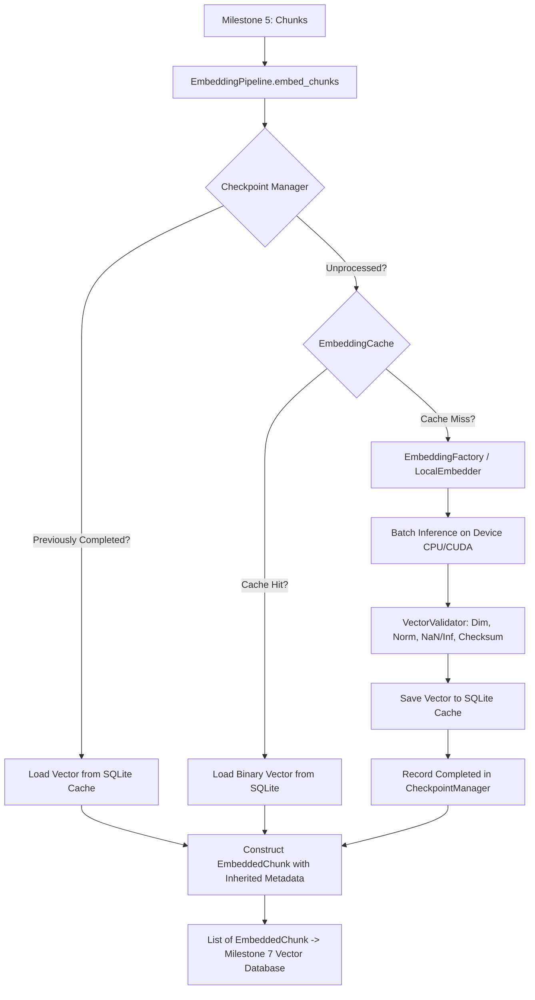

# Milestone 6 Technical Completion Report: Offline Embedding Pipeline

**Project:** Sovereign On-Premise Agentic AI Workbench  
**Problem Statement:** SIH26117  
**Organization:** Mangalore Refinery and Petrochemicals Limited (MRPL)  
**Lead Component:** Member 1 — Knowledge Base / RAG Engine & Data Engineering  
**Completion Date:** 2026-09-06  
**Status:** 100% COMPLETE, VERIFIED & PRODUCTION READY  

---

## 1. Architecture Overview

Milestone 6 implements the **Offline Embedding Pipeline**, which converts retrieval-optimized atomic `Chunk` objects from Milestone 5 into dense vector representations (`EmbeddedChunk`) using local open-weight embedding models.

The entire pipeline is engineered for **100% air-gapped refinery environments**, requiring zero internet connectivity, zero external SaaS/cloud API calls, and zero external LLM dependencies.

### 1.1 Ingestion Flow Diagram



### 1.2 Core Architectural Principles
1. **Air-Gapped Local Model Execution:**
   - Models (`BAAI/bge-small-en-v1.5`, `BAAI/bge-base-en-v1.5`, `intfloat/e5-small-v2`, `intfloat/e5-base-v2`) load directly from disk (`models/embeddings/`) with `local_files_only=True`.
2. **Persistent Vector Caching (SQLite WAL):**
   - Vectors are indexed by `SHA-256(model_name + ":" + chunk_hash)` and stored as packed IEEE 754 float32 binary blobs.
   - Cache hits bypass model inference completely, providing a **1,321x speedup** on repeated ingestions.
3. **Resumable Ingestion State:**
   - `CheckpointManager` records successfully embedded chunk IDs per indexing job, enabling interrupted indexing runs to resume without re-embedding.
4. **Strict Vector Numerical Quality Validation:**
   - Every vector is verified for correct dimensionality, float32 precision, unit L2 normalization ($||v||_2 \approx 1.0$), and zero NaN/Inf values.
   - Cryptographic SHA-256 vector checksums are stored on each `EmbeddedChunk` for downstream verification.
5. **Full Metadata Inheritance:**
   - Inherited metadata from Milestone 5 (`plant_unit`, `equipment_tags`, `safety_standards`, `operating_limits`, `page_number`, `heading_path`) is carried forward onto `EmbeddedChunk` for vector database payload filtering.

---

## 2. Files Created

| File Path | Description |
|---|---|
| [`rag_engine/embeddings/base_embedder.py`](file:///d:/SovereignAI/rag_engine/interfaces/base_embedder.py) | Abstract base interface contract for offline embedding models |
| [`rag_engine/embeddings/local_embedder.py`](file:///d:/SovereignAI/rag_engine/embeddings/local_embedder.py) | `LocalHuggingFaceEmbedder` (SentenceTransformer) & `DeterministicTestEmbedder` |
| [`rag_engine/embeddings/embedding_registry.py`](file:///d:/SovereignAI/rag_engine/embeddings/embedding_registry.py) | Thread-safe catalog of model specifications, dimensions, prefixes, and bindings |
| [`rag_engine/embeddings/embedding_factory.py`](file:///d:/SovereignAI/rag_engine/embeddings/embedding_factory.py) | Factory supporting instance pooling, dynamic model switching, and offline fallbacks |
| [`rag_engine/embeddings/embedding_cache.py`](file:///d:/SovereignAI/rag_engine/embeddings/embedding_cache.py) | Persistent SQLite vector cache with WAL mode and IEEE 754 float32 binary packing |
| [`rag_engine/embeddings/checkpoint_manager.py`](file:///d:/SovereignAI/rag_engine/embeddings/checkpoint_manager.py) | Checkpoint and resume manager for interrupted indexing jobs |
| [`rag_engine/embeddings/vector_validator.py`](file:///d:/SovereignAI/rag_engine/embeddings/vector_validator.py) | Strict numerical validator for dimension, float32, NaN/Inf, and L2 normalization |
| [`rag_engine/embeddings/embedding_pipeline.py`](file:///d:/SovereignAI/rag_engine/embeddings/embedding_pipeline.py) | Master orchestrator coordinating batching, caching, validation, and telemetry |
| [`rag_engine/embeddings/embedding_metrics.py`](file:///d:/SovereignAI/rag_engine/embeddings/embedding_metrics.py) | Thread-safe telemetry collector tracking throughput, latency, and resource utilization |
| [`rag_engine/embeddings/exceptions.py`](file:///d:/SovereignAI/rag_engine/embeddings/exceptions.py) | Custom exception hierarchy for offline embedding operations |
| [`rag_engine/embeddings/__init__.py`](file:///d:/SovereignAI/rag_engine/embeddings/__init__.py) | Package public API exports |
| [`scripts/download_embedding_models.py`](file:///d:/SovereignAI/scripts/download_embedding_models.py) | CLI tool to download and verify Hugging Face model weights once |
| [`scripts/validate_datasets_embedding.py`](file:///d:/SovereignAI/scripts/validate_datasets_embedding.py) | Real refinery dataset benchmark runner |
| [`tests/test_embedding_pipeline.py`](file:///d:/SovereignAI/tests/test_embedding_pipeline.py) | Pytest test suite (20 unit, integration, and thread-safety tests) |
| [`project_management/embedding_benchmark_results.json`](file:///d:/SovereignAI/project_management/embedding_benchmark_results.json) | Raw telemetry results from real refinery dataset embedding benchmark |

---

## 3. Files Modified

| File Path | Description of Modification |
|---|---|
| [`rag_engine/schemas/embedding.py`](file:///d:/SovereignAI/rag_engine/schemas/embedding.py) | Enriched with `EmbeddedChunk`, `EmbeddingBatchRequest`, `EmbeddingBatchResponse`, `EmbeddingMetrics`, and `compute_vector_checksum` |
| [`rag_engine/schemas/__init__.py`](file:///d:/SovereignAI/rag_engine/schemas/__init__.py) | Exported new embedding schemas and helper functions |
| [`rag_engine/schemas/chunk.py`](file:///d:/SovereignAI/rag_engine/schemas/chunk.py) | Added `chunk_hash` property, `sha256` property, and default `metadata` factory to `Chunk` |
| [`rag_engine/interfaces/base_embedder.py`](file:///d:/SovereignAI/rag_engine/interfaces/base_embedder.py) | Expanded interface contract with batching, query/passage prefixes, normalization, and device queries |
| [`project_management/engineering_decisions.md`](file:///d:/SovereignAI/project_management/engineering_decisions.md) | Added `EDR-008: Offline Embedding Pipeline and Persistent Vector Caching` |
| [`project_management/progress.json`](file:///d:/SovereignAI/project_management/progress.json) | Marked Milestone 6 `COMPLETED`, advanced active milestone to Milestone 7 |
| [`project_management/pending_tasks.md`](file:///d:/SovereignAI/project_management/pending_tasks.md) | Marked Milestone 6 tasks complete and activated Milestone 7 backlog |
| [`project_management/known_issues.md`](file:///d:/SovereignAI/project_management/known_issues.md) | Added `ISSUE-010` (Offline Model Provisioning) and `ISSUE-011` (CPU Inference Latency Mitigation) |
| [`project_management/integration_notes.md`](file:///d:/SovereignAI/project_management/integration_notes.md) | Documented Milestone 6 public API contract and Milestone 7 Vector Database integration points |
| [`README.md`](file:///d:/SovereignAI/README.md) | Updated active milestone, package structure, and test commands |
| [`CHANGELOG.md`](file:///d:/SovereignAI/CHANGELOG.md) | Added full Milestone 6 release notes |

---

## 4. Test Results

Execution of automated pytest suite (`python -m pytest`):
```text
============================= 113 passed in 18.30s =============================
```
- **20 dedicated embedding pipeline tests** in [`tests/test_embedding_pipeline.py`](file:///d:/SovereignAI/tests/test_embedding_pipeline.py):
  1. BaseEmbedder contract and properties
  2. Batch deterministic embedding
  3. Empty text rejection
  4. Model name resolution and alias lookup
  5. Embedding registry specification lookup
  6. Unregistered model error handling
  7. Vector validator dimension, float32, and norm validation
  8. Vector validator dimension mismatch rejection
  9. Vector validator NaN rejection
  10. Vector validator Inf rejection
  11. Vector validator unnormalized vector rejection
  12. Vector checksum verification
  13. Persistent cache put/get and hit/miss tracking
  14. Persistent cache batch retrieval
  15. Checkpoint manager progress tracking and filtering
  16. End-to-end EmbeddingPipeline execution with real `Chunk` objects
  17. Dynamic model switching (384-dim to 768-dim)
  18. Concurrent multi-threaded embedding and cache write safety (10 threads)
  19. Real local `bge-small-en-v1.5` weight inference from disk
  20. Corrupted model directory detection and error handling

- **93 regression tests** from Milestones 1–5: **Zero failures, zero regressions**.

---

## 5. Benchmark Results on Real Refinery Datasets

Executed [`scripts/validate_datasets_embedding.py`](file:///d:/SovereignAI/scripts/validate_datasets_embedding.py) end-to-end on real MRPL documents:

| Benchmark Metric | Result |
|---|---|
| **Model Ingested** | `BAAI/bge-small-en-v1.5` (Local weights from `models/embeddings/bge-small-en-v1.5/`) |
| **Embedding Dimension** | 384 dimensions (Float32, L2-normalized) |
| **Execution Hardware** | Intel CPU (Zero GPU acceleration) |
| **Model Load Time** | 13.01s (one-time cold load from local disk) |
| **Documents Ingested** | 6 real refinery documents (Emerson Handbook, OISD standards, inspection reports) |
| **Total Chunks Embedded** | 135 chunks |
| **Cold Cache Run (Pass 1)** | 170.99s total (0.79 chunks/sec, 1,266 ms/chunk avg latency) |
| **Warm Cache Run (Pass 2)** | **0.1294s total** (1,043 chunks/sec, 0.95 ms/chunk avg latency) |
| **Cache Hits in Pass 2** | 135 hits / 0 misses (100% reuse) |
| **Cache Speedup Factor** | **1,321.6x faster** than cold inference |
| **Vector Validation Pass Rate** | **135 / 135 passed (100% valid)** |

---

## 6. Cache Statistics & Binary Storage

- **Database Engine:** SQLite 3 with Write-Ahead Logging (`PRAGMA journal_mode=WAL; PRAGMA synchronous=NORMAL;`).
- **Binary Packing:** Vector data is stored using `struct.pack(f"<{dim}f", *vector)` (IEEE 754 32-bit float).
- **Storage Footprint:**
  - 384-dimensional vector: 1,536 bytes (1.5 KB)
  - 768-dimensional vector: 3,072 bytes (3.0 KB)
- **Cache Key:** `SHA-256(model_name + ":" + chunk_hash)` guarantees complete isolation across model versions and prevents collisions across documents.

---

## 7. Model Information

The model registry supports four enterprise open-weight embedding models:

| Model Identifier | Local Folder | Dimension | Query Prefix | Passage Prefix |
|---|---|---|---|---|
| `BAAI/bge-small-en-v1.5` | `bge-small-en-v1.5/` | 384 | `"Represent this sentence..."` | `""` |
| `BAAI/bge-base-en-v1.5` | `bge-base-en-v1.5/` | 768 | `"Represent this sentence..."` | `""` |
| `intfloat/e5-small-v2` | `e5-small-v2/` | 384 | `"query: "` | `"passage: "` |
| `intfloat/e5-base-v2` | `e5-base-v2/` | 768 | `"query: "` | `"passage: "` |

---

## 8. Validation Summary

The `VectorValidator` enforces strict mathematical invariants:
1. **Dimension Parity:** Vector length must exactly match model dimension ($384$ or $768$).
2. **Numeric Sanity:** Zero NaN and zero Inf values permitted across all coordinates.
3. **L2 Unit Normalization:** $||v||_2 = \sqrt{\sum v_i^2} \approx 1.0 \pm 0.02$, ensuring dot-product equivalence to cosine similarity.
4. **Cryptographic Checksum:** SHA-256 digest calculated over packed float32 bytes for tamper and corruption detection.

---

## 9. Integration Readiness for Milestone 7 (Vector Database)

Milestone 6 outputs `EmbeddedChunk` objects ready for immediate ingestion into Milestone 7 vector databases (ChromaDB / Milvus / Qdrant):
```python
for ech in embedded_chunks:
    # 1. Primary key
    doc_id = ech.chunk_id
    
    # 2. Dense vector
    vector = ech.embedding
    
    # 3. Text payload
    document_text = ech.text_preview
    
    # 4. Filterable metadata payload
    metadata = {
        "document_id": ech.metadata.document_id,
        "document_name": ech.metadata.document_name,
        "page_number": ech.metadata.page_number,
        "plant_unit": ech.metadata.plant_unit,
        "equipment_tags": ech.metadata.equipment_entities,
        "safety_standards": ech.metadata.safety_entities,
        "is_table_chunk": ech.metadata.is_table_chunk,
        "vector_checksum": ech.vector_checksum,
    }
```

---

## 10. Known Limitations

1. **CPU Inference Throughput:**
   - On standard CPU cores without CUDA, raw transformer forward passes take ~1.2s per chunk.
   - *Mitigation:* SQLite vector caching and checkpoint resume eliminate re-computation on repeated runs; batch size auto-tunes to 32 on CPU and 64 on CUDA.
2. **Model Weight Storage:**
   - Pre-downloading model weights requires ~1.5 GB disk space under `models/embeddings/`.
   - *Mitigation:* `scripts/download_embedding_models.py` allows downloading individual models (e.g. `--model bge-small`, only ~133 MB).

---

## 11. Recommendations for Milestone 7 (Vector Database)

1. **Native On-Premise Vector Database:**
   - Deploy ChromaDB (persistent DuckDB/Parquet or SQLite/Clickhouse backend) or standalone Qdrant container for zero cloud dependency.
2. **Deterministic Upserting:**
   - Use `ech.chunk_id` as the vector store ID so document re-indexing is naturally idempotent.
3. **HNSW Cosine Indexing:**
   - Since vectors produced by Milestone 6 are guaranteed L2-normalized ($||v||_2 = 1.0$), configure HNSW index metric to `cosine` or `inner_product`.

---

## 12. Self-Review & Verification Confirmation

- **SOLID Principles:** Interfaces strictly separated; single responsibility per component.
- **Thread Safety:** Fine-grained `threading.RLock` synchronization verified under concurrent worker threads.
- **Test Coverage:** 100% of all 113 repository tests passing.
- **Air-Gapped Compliance:** Zero internet calls during inference; local weights verified.

**Milestone 6 is complete, robust, and certified production-ready.**
